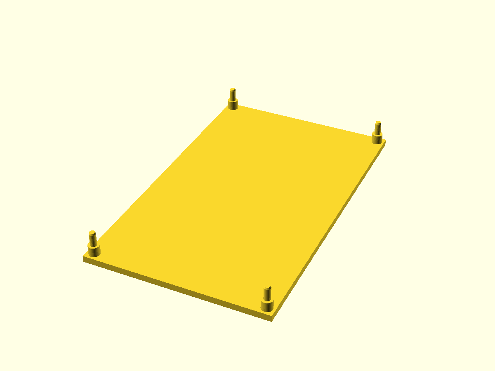
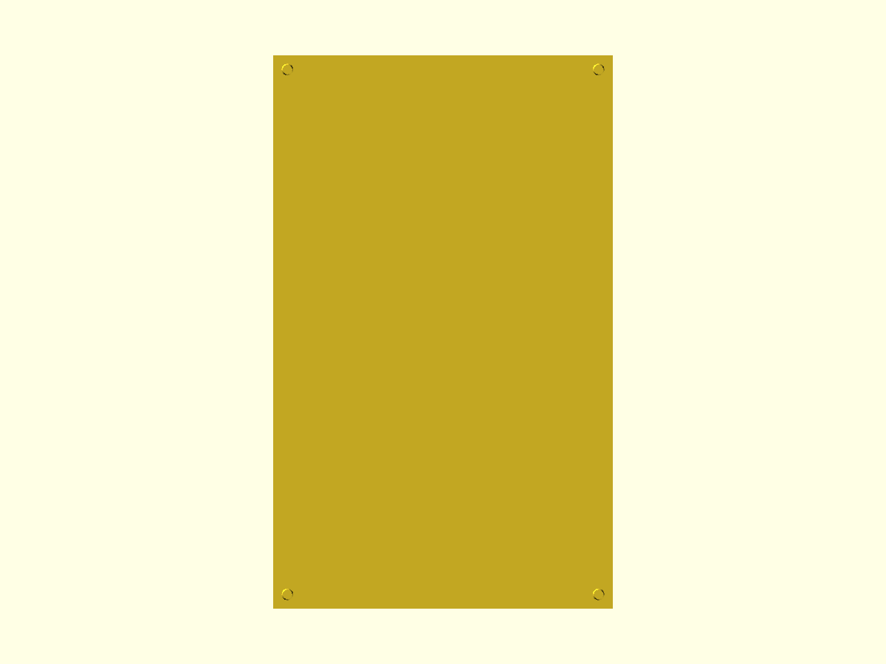

# Корпус для Sunton 5" (основание + рамка)

Параметрическая модель из двух деталей:
- основание `base` — площадка с стойками и штырями под плату;
- рамка `frame` — пластина с окном под экран и отверстиями под штыри.

Оси и порядок размеров: X = ширина (`width`), Y = высота (`height`).

## Файлы
- `case-5.scad` — основная модель.

## Версия модели
- v1.7 — анизотропная фаска снизу; режим тест‑фрагментов; echo‑контроль полей.

## Фрагменты модели
- `base`: основание со стойками и штырями
- `frame`: рамка с окном под экран
- Тест‑фрагменты углов: индексы `frag_index` = 0 (НЛ), 1 (ВЛ), 2 (НП), 3 (ВП)

## Ключевые параметры (в начале SCAD)
```scad
$fn = 0; $fa = 6; $fs = 0.35; pin_fs = 0.25;
test_fragment = false; frag_size = 20; frag_index = 0; frag_gap_x = 10; frag_h_extra = 20;
print_base = true; print_frame = false;
tiny = 0.1; edge_chamfer_z = 4; edge_chamfer_x = 1.6; edge_chamfer_y = 1.6; screen_frame_gap = 0.2;
board_width = 84; board_height = 137; board_thickness = 1.5;
screen_width = 75.5; screen_height = 120;
frame_thickness = 5; window_clearance_x = 0.5; window_clearance_y = 0.8;
hole_spacing_x = 75; hole_spacing_y = 129; hole_diameter_board = 3;
standoff_outer_diam = 5; standoff_height = 4.5; pin_extra = frame_thickness; pin_diam = hole_diameter_board - 0.1; pin_tip_h = 0.8;
```

## Вычисляемые размеры
- `base_width = board_width`
- `base_height = board_height`
- Позиции отверстий `hole_positions` вычисляются из `hole_spacing_*` и отступов `edge_*`.
- Окно экрана: `open_width`, `open_height`, смещения `open_off_x`, `open_off_y`.

## Печать
- Печатать основание и рамку лучше раздельно: выставьте флаги
  - только основание: `print_base=true; print_frame=false;`
  - только рамка: `print_base=false; print_frame=true;`
  - обе детали: оба флага `true` (рамка сдвигается по Y на `base_height + 10`).

## Тест‑фрагменты
Включите `test_fragment=true` для печати только угловых вырезок деталей. Полезно для проверки посадки:
- `frag_index` выбирает угол: 0=НЛ, 1=ВЛ, 2=НП, 3=ВП;
- `frag_size` — размер вырезки; `frag_gap_x` — расстояние между вырезками base и frame;
- `frag_h_extra` — дополнительная высота объёма клипа.

## Фаски и точность
- Фаска снизу по периметру, независимая по Z и по горизонтали (`edge_chamfer_z`, `edge_chamfer_x`, `edge_chamfer_y`).
- Точность:
  - глобально: `$fn=0`, `$fa=6`, `$fs=0.35`;
  - для штырей/отверстий: `$fs=pin_fs`.

## Лицензия
MIT

## Превью






