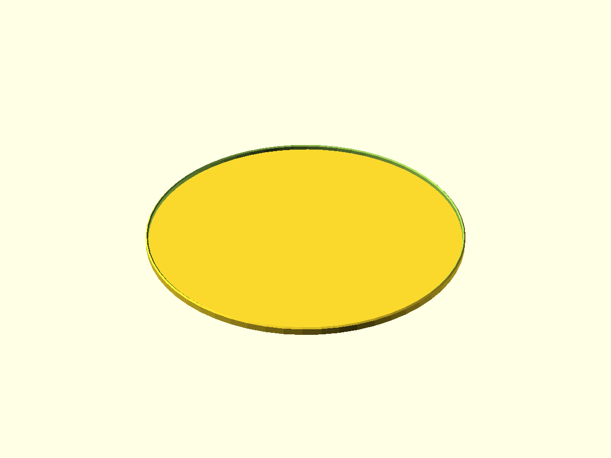
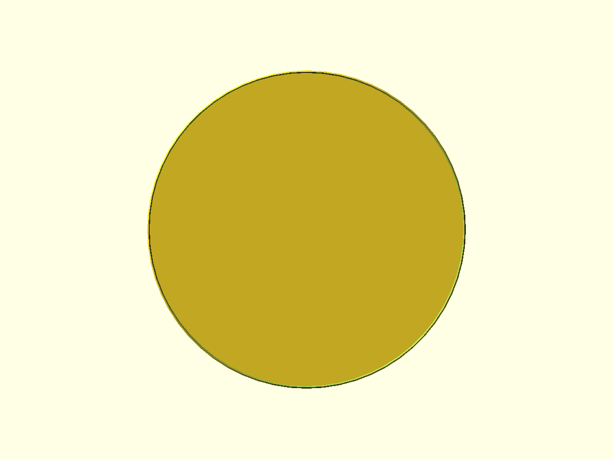

# Plate Cap Ø123.6 (1 mm wall, 5 mm height)

Параметрическая круглая крышка-колпак.

- Файл модели: `plate-cap-123.scad`
- Версия: 1.0

## Параметры
- Внутренний диаметр: 123.6 мм (с посадочным запасом `fit_extra_inner`)
- Толщина стенки: 1.0 мм
- Толщина верхней крышки: 1.0 мм
- Внешняя высота: 5.0 мм
- Радиусы скругления кромки: 1–2 мм (`radius_r`)

## Рендер
Включите/отключите `test_fragment` для печати тестовых вырезок.

## Превью

