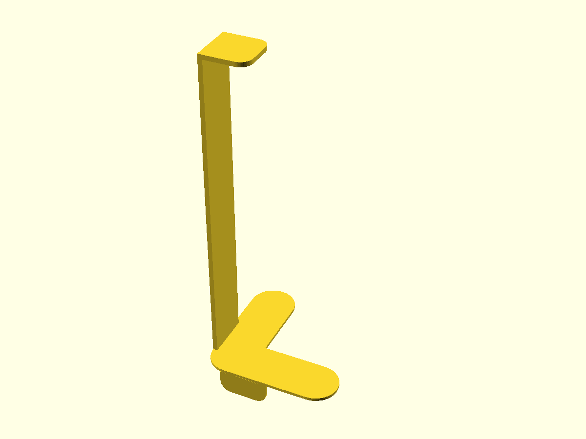

# Ceiling Corner Support for Printer Frame

Параметрическая подпорка для угла рамы 3D‑принтера (упор в потолок). Модель включает нижние «лапки» на раму, вертикальную стойку и верхнюю площадку. Есть тест‑фрагменты для быстрой проверки размеров.

- Файл модели: `printer-ceiling.scad`
- Версия: 1.1
- Оси: X — вправо, Y — вперёд, Z — вверх

## Состав модели (модули/фрагменты)
- `base` — полная сборка: объединяет `bottom_pad(len)`, скругление угла, `post(h)`,
  `top_pad()`, `wrap_tabs()`; параметры `len` и `h` берутся из `arm_len_full`/`post_h_full`
  либо укороченные `arm_len_tf`/`post_h_tf` при `test_fragment=true`.
- `top_pad` — верхняя площадка, квадрат с полукруглым правым торцом: габариты по XY —
  `pad_xy × pad_y`, толщина `top_pad_th`; располагается на вершине стойки на
  Z=`base_th + post_h_*` (в зависимости от режима тест‑фрагментов). Скругления контролируются
  `radius_r`.
- `post` — вертикальная стойка прямоугольного сечения `post_th × frame_w` со скруглениями,
  высота `post_h_full` (или `post_h_tf` в тест‑режиме). Основание на Z=`base_th`,
  уходит вверх вдоль Z, прилегая к внутреннему углу лапок.
- `bottom_pad` — нижняя L‑образная площадка («лапки»), две полосы шириной `frame_w` и длиной
  `arm_len_full` (или `arm_len_tf` в тест‑режиме), толщиной `base_th`. Внутренний угол
  скруглён радиусом `radius_r`. Лежит на столе (Z=0), уходит в +X и +Y.
- `left_wrap`, `right_wrap` — вертикальные «обжимные» лапки, охватывают раму снаружи вдоль
  сторон Y и X соответственно. Толщина стенки `wrap_th`, высота вниз `wrap_h` (ниже Z=0),
  ширина прижатия `wrap_w` (обычно = `frame_w`). Имеют закругление по нижней кромке,
  чтобы мягко заходить на профиль рамы.
- `wrap_tabs` — сервисный модуль, просто вызывает `left_wrap()` и `right_wrap()` вместе.
- `add_supports` — опциональные рёбра жёсткости (косынки) в плоскостях XZ и YZ, вылет
  `support_len`, высота `support_h`, толщина экструзии = `post_th`. Включаются флагом
  `supports`.
- `clip_for_fragments` — клиппер для режима `test_fragment=true`: выводит два
  укороченных фрагмента — у основания и в зоне верхней площадки. Окна клипа задаются
  `frag_size`, `frag_gap_x`, `frag_h_extra`.

## Ключевые параметры
```scad
// Точность
$fn = 0; $fa = 6; $fs = 0.35; pin_fs = 0.25;

// Тест‑фрагменты (при true печатаются два укороченных клипа)
test_fragment = false;  // true — напечатать только фрагменты
frag_size = 20; frag_index = 0; frag_gap_x = 10; frag_h_extra = 20;

// Фаски/скругления
tiny = 0.1;
edge_chamfer_z = 1; edge_chamfer_x = 5; edge_chamfer_y = 5; // для совместимости; в этой модели не критично
radius_r = 30; // общий радиус скруглений 2D‑контуров

// Габариты и толщины
frame_w = 30;      // ширина рамы (и лапок)
post_th = 3;       // толщина стойки
base_th = 2;       // толщина горизонтальных лапок
top_pad_th = 3;    // толщина верхней площадки

// Высоты и длины
gap_total   = 213; // расстояние от верха рамы до потолка
post_h_full = gap_total - (base_th + top_pad_th);
arm_len_full = 87; // длина лапок по X и Y

// Обжимные лапки (вертикальные)
wrap_h = 15; wrap_w = frame_w; wrap_th = 2;

// Верхняя площадка
pad_xy = 30; pad_y = wrap_w; top_pad_off_x_extra = 0;

// Рёбра жёсткости (опционально)
supports = true; support_len = 28; support_h = 40;

// Значения для test_fragment
arm_len_tf = 40; height_tf_total = 50; post_h_tf = height_tf_total - (base_th + top_pad_th);
```

## Использование
- Откройте `printer-ceiling.scad` в OpenSCAD.
- По умолчанию выводится `base()` в обёртке `clip_for_fragments()`.
- Для быстрой проверки размеров включите `test_fragment = true` — будет выведено два клипа (у основания и в зоне верхней площадки), разнесённые по X на `frag_gap_x`.
- Подгоняйте посадку, меняя `frame_w`, `arm_len_full`, `wrap_h`, `wrap_th`, `radius_r` и пр.

## Печать и ориентация
- Печать в стандартной ориентации Z вверх (как в сцене): нижние лапки на столе.
- Опционально добавьте брим под лапки при малой толщине (`base_th`).
- Рёбра (`supports=true`) увеличивают жесткость, но усложняют печать — при необходимости отключайте.

## Примечания по геометрии
- Скругления построены 2D‑офсетом и экструзией; точность для окружностей настраивается через `$fs`/`$fa`.
- Радиусы автоматически ограничиваются так, чтобы не выходить за габарит элементов.
- Координатный ноль выбран в углу рамы (пересечение осей лапок). Элементы уходят в +X и +Y.

## Лицензия
MIT

## Превью




