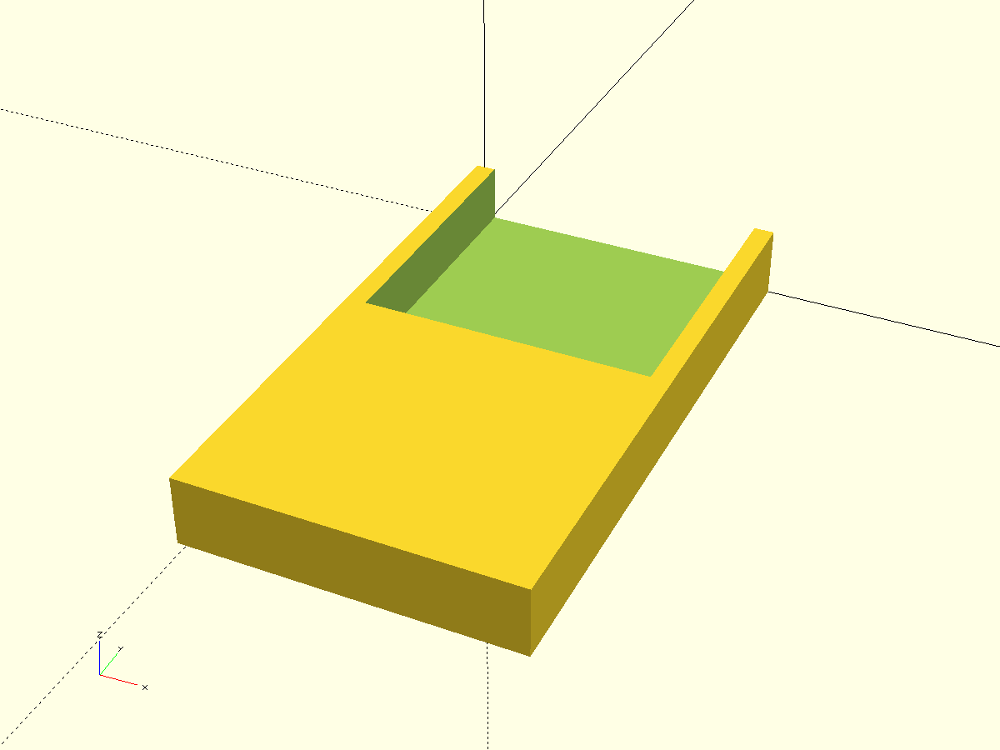
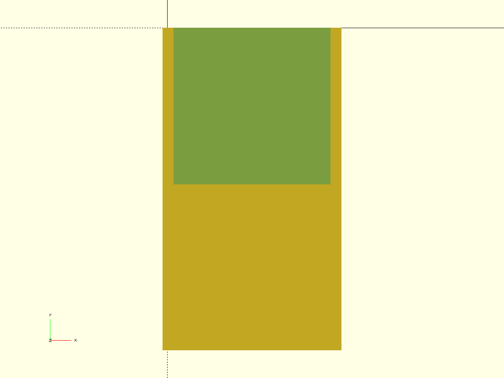
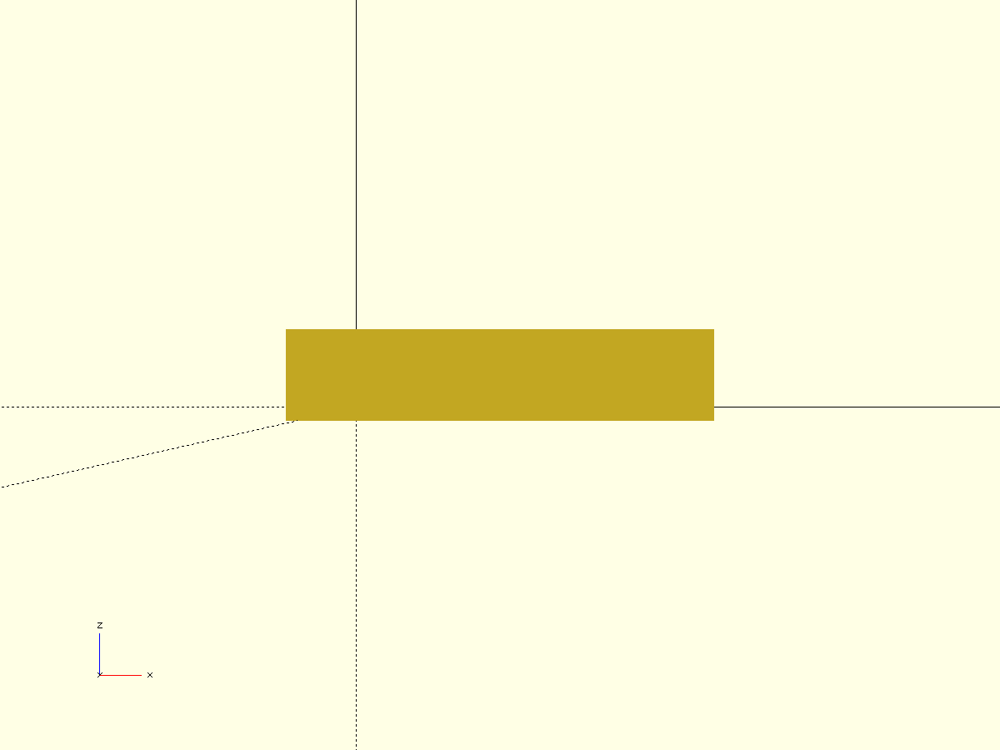
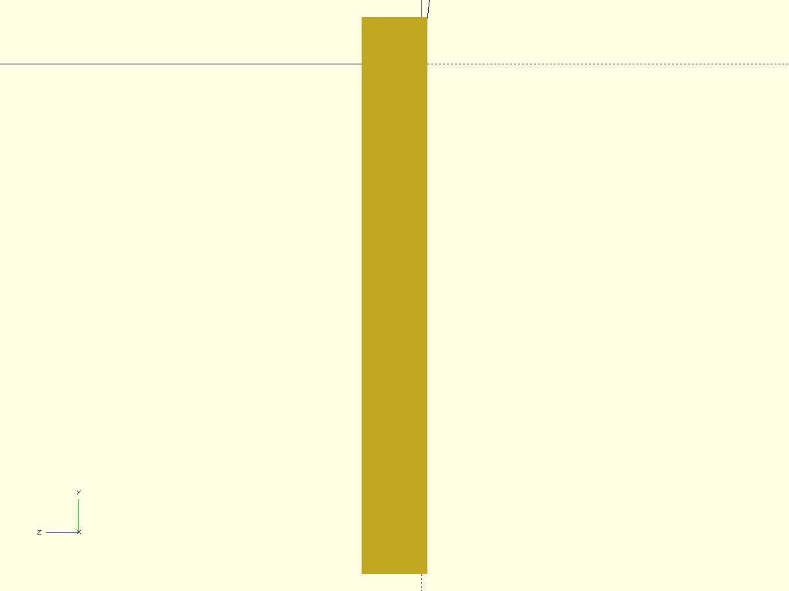

# phone iphone14 mini table holder

- Файл модели: `phone-holder.scad`
- Версия: 1.0

## Ключевые параметры (см. начало SCAD)
- $fn, $fa, $fs, pin_fs — точность окружностей
- test_fragment, frag_* — тест‑фрагменты
- edge_chamfer_*, tiny — фаски/совм.

## Описание
Держатель для телефона под столешницу с карманом и боковыми ушками‑креплениями. 
Карман рассчитан на телефон шириной 65 мм, высотой 131 мм, толщиной 10 мм (параметризовано). 
Снизу кармана сделан вырез на 50% глубины для удобства захвата.

## Параметры модели
- phone_w, phone_h, phone_t — габариты телефона
- pocket_clear_xy, pocket_clear_z — зазоры внутри кармана
- wall_xy, wall_z, back_wall — толщины стенок
- handle_ext — вылет ушек по сторонам (по умолчанию 10 мм)
- holes_per_side, hole_diam, holes_edge_y — отверстия под саморезы (4 шт.)
- notch_depth_ratio, notch_h, notch_r_xy — нижний вырез кармана
- body_r_xy, pocket_r_xy — скругления корпуса и кармана

## Печать/монтаж
- Печать основанием к столу, без поддержек.
- Саморезы — по 2 на каждую сторону. Диаметр отверстия задаётся `hole_diam`.
- При первой печати рекомендуется включить `test_fragment = true` и подобрать зазоры.

## Превью

