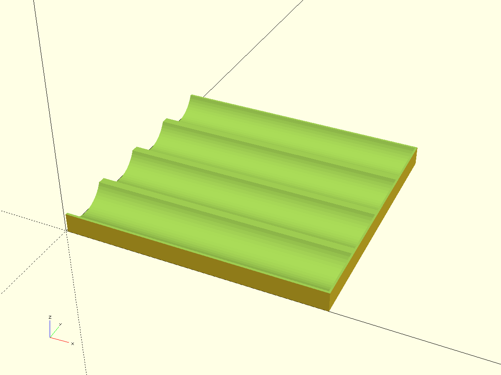
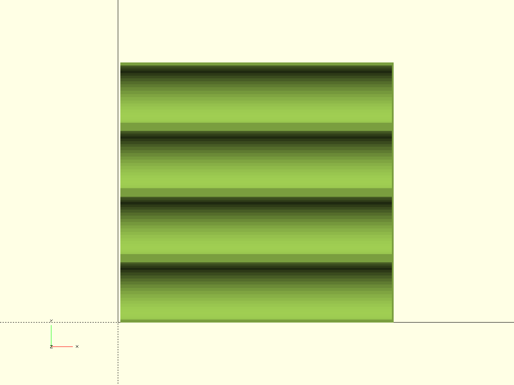

# Horizontal Holder for 4 Bottles (130×30)

Параметрическая горизонтальная подставка для четырёх бутылок/флаконов длиной ~130 мм и диаметром ~30 мм. Держатель как можно ниже по высоте, с облегчёнными перемычками, с регулируемыми прокладками между бутылками 1–2 мм.

- Файл модели: `bottles-holder.scad`
- Версия: 1.0
- Оси: X — вдоль рядов, Y — поперёк (между бутылками), Z — вверх

## Состав модели (модули/фрагменты)
- `base` — полная сборка держателя (2 продольные направляющие + 4 полулунные ложемента + перемычки)
- `rail_left`, `rail_right` — продольные направляющие (низкий профиль), соединяются перемычками
- `cradle_row` — ряд полулунных ложементов под бутылки
- `bridges_light` — облегчённые поперечные перемычки (поддержки) между рельсами
- `end_stops` — низкие торцевые упоры, чтобы бутылки не съезжали
- `clip_for_fragments` — клиппер для режима тест‑фрагментов

## Ключевые параметры
```scad
// Точность
$fn = 0; $fa = 6; $fs = 0.35; pin_fs = 0.25;

// Тест‑фрагменты
test_fragment = false;      // true — печатать только фрагменты
frag_size     = 20;         // окно вырезки, мм
frag_gap_x    = 10;         // разнос фрагментов, мм
frag_h_extra  = 12;         // запас по высоте, мм

// Габариты бутылки и ряда
bottle_diam   = 30;         // диаметр, мм
bottle_len    = 130;        // длина, мм
num_bottles   = 4;          // число бутылок
pad_between   = 1.5;        // прокладка/зазор между бутылками (1–2 мм)

// Геометрия держателя
wall_th       = 2;          // толщина стенок рельс
bridge_th     = 2;          // толщина облегчённых перемычек
bridge_pitch  = 35;         // шаг перемычек по X
end_stop_h    = 6;          // высота торцевого упора
end_stop_th   = 2;          // толщина торцевого упора

// Ограничение по высоте
max_h         = 50;         // максимум по Z
// реальная высота ложемента автоматически ограничивается так,
// чтобы уложиться в max_h с учётом рельс и перемычек
```

## Идея конструкции
- Две низкие продольные рельсы ниже ложемента. Ложементы полу‑цилиндрические (выполнение как вырез в бруске), радиус = `bottle_diam/2`.
- Между рельсами — облегчённые поперечные перемычки (щели), чтобы снизить массу и расход пластика.
- Торцевые упоры не дают бутылкам скатываться при перемещении.
- Между соседними бутылками закладывается зазор `pad_between` для вентиляции/неперетирания этикеток.

## Печать
- Ориентация: печатать как есть, Z вверх. Рельсы образуют базу, ложементы сверху.
- Поддержки не требуются. Перемычки печатаются мостами (толщина `bridge_th`).
- При необходимости включайте `test_fragment=true` для проверки посадки по диаметру/зазору — будет выведен укороченный клип.

## Использование параметров
- Для других бутылок меняйте `bottle_diam`, `bottle_len`, `num_bottles`, `pad_between`.
- Если нужен ещё более низкий профиль — уменьшайте `end_stop_h` и `bridge_th`, следя за жёсткостью.
- Высота автоматически ограничена `max_h`.

## План SCAD‑файла
- Версия модели и комментарии
- Переменные (все размеры вверху файла)
- Модули фрагментов (`rail_left`, `rail_right`, `cradle_row`, `bridges_light`, `end_stops`)
- Сборка `base()` и вывод через `clip_for_fragments()`

## Лицензия
MIT

## Превью






