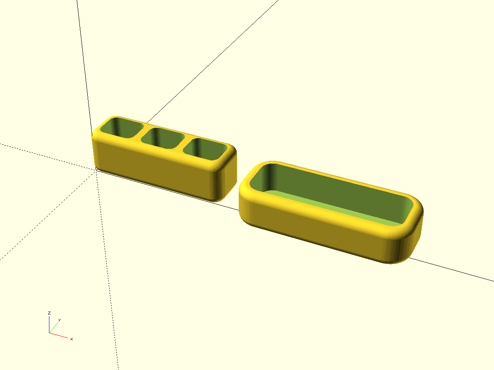
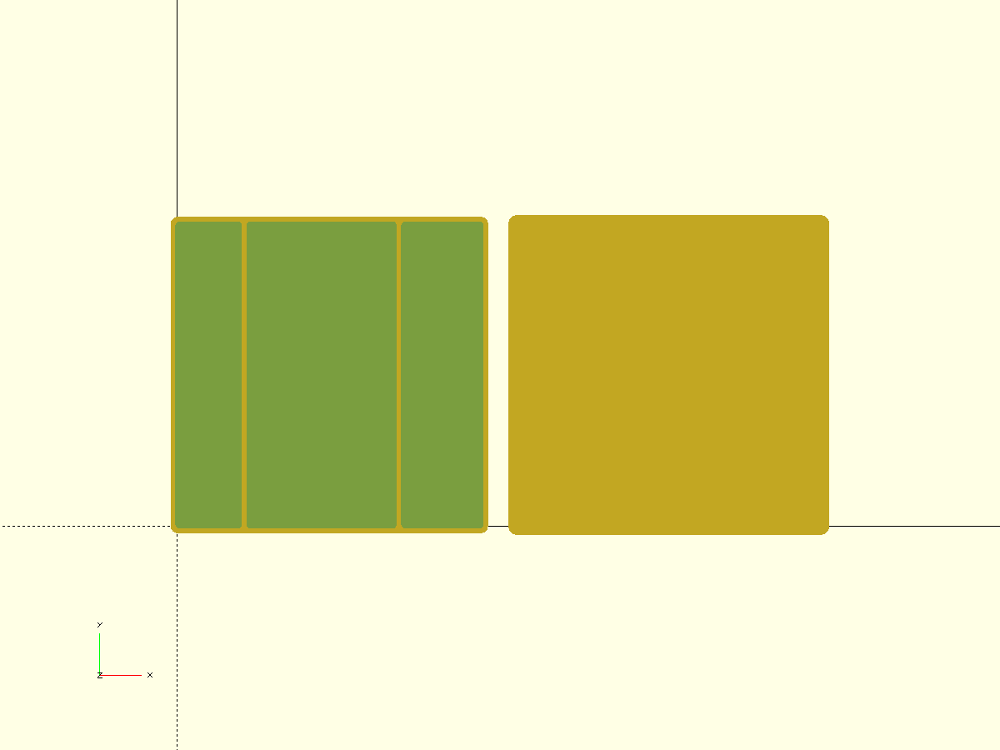
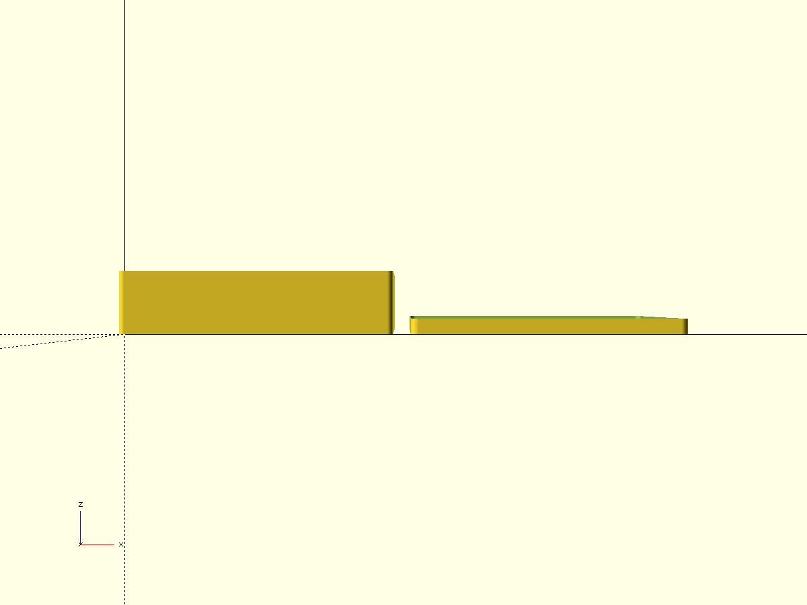
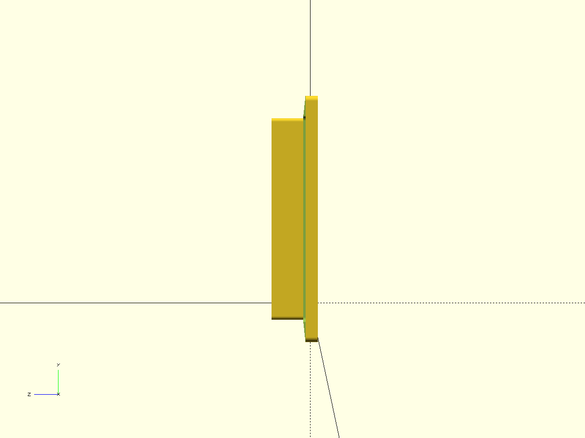

# 3-sections-box

- Файл модели: `audio-case.scad`
- Версия: 1.0

## Структура модели (5 фигур)
- `base_fill()` — базовый объём внешнего контура (вся высота), скругления `radius_r`.
- `section_red()` — вырез левого отсека (скруглённые углы `sec_corner_r`).
- `section_yellow()` — вырез среднего отсека (скруглённые углы `sec_corner_r`).
- `section_green()` — вырез правого отсека (скруглённые углы `sec_corner_r`).
- `base()` = `difference()` из `base_fill()` минус три `section_*()`.

Стенки по периметру имеют толщину `wall_th`, перегородки между секциями — `divider_th`.

## Ключевые параметры (см. начало SCAD)
- `$fn`, `$fa`, `$fs`, `pin_fs` — точность окружностей.
- `test_fragment`, `frag_*` — печать угловых тест‑фрагментов.
- `tiny`, `edge_chamfer_*`, `screen_frame_gap` — зазоры/фаски.
- Геометрия:
  - `wall_th`, `divider_th`, `bottom_th`, `inner_h`
  - `red_w`, `yellow_w`, `green_w` — ширины отсеков по X
  - `inner_y` — базовая глубина по Y (требуется подтверждение фактического значения)
  - `inner_y_shift` — сдвиг глубины для секций с учётом стенки (`inner_y - wall_th`)
  - `radius_r` — радиус скругления наружного прямоугольника
  - `sec_corner_r` — радиус скругления углов внутренних секций
  - `section_x_offset`, `section_y` — смещения секционных вырезов от краёв
- Крышка (если печатается): `cap_top_th`, `cap_lip_h`, `cap_fit_clearance`, `cap_outer_margin`.

## Использование
- По умолчанию выводится `all_parts()` через клиппер `clip_for_fragments{ ... }`.
- Флаги печати: `print_box` (основание), `print_cap` (крышка).
- Для теста угловых вырезок установите в начале файла: `test_fragment = true;` и выберите `frag_index` (0..3).

## Превью

