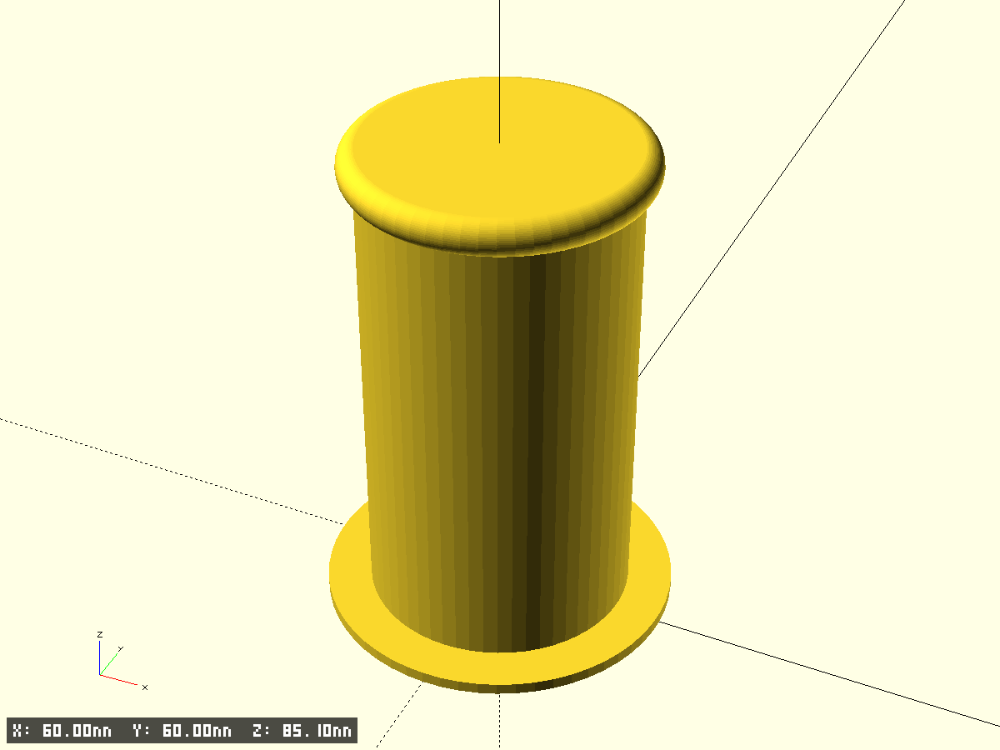
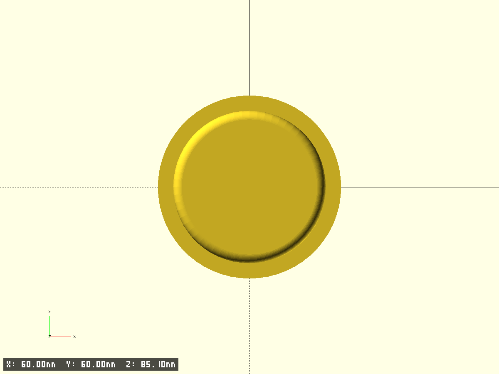
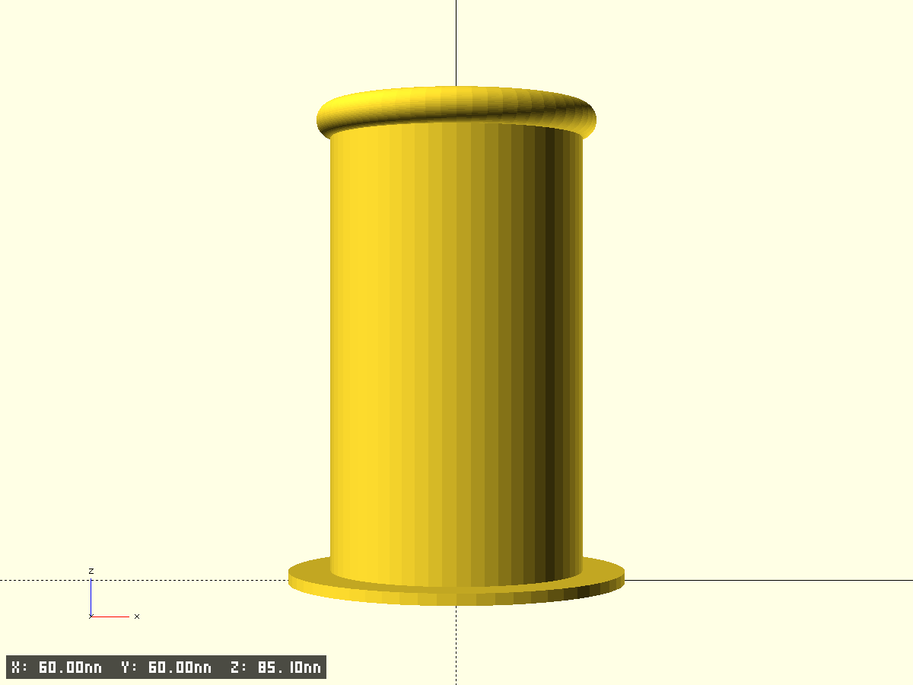
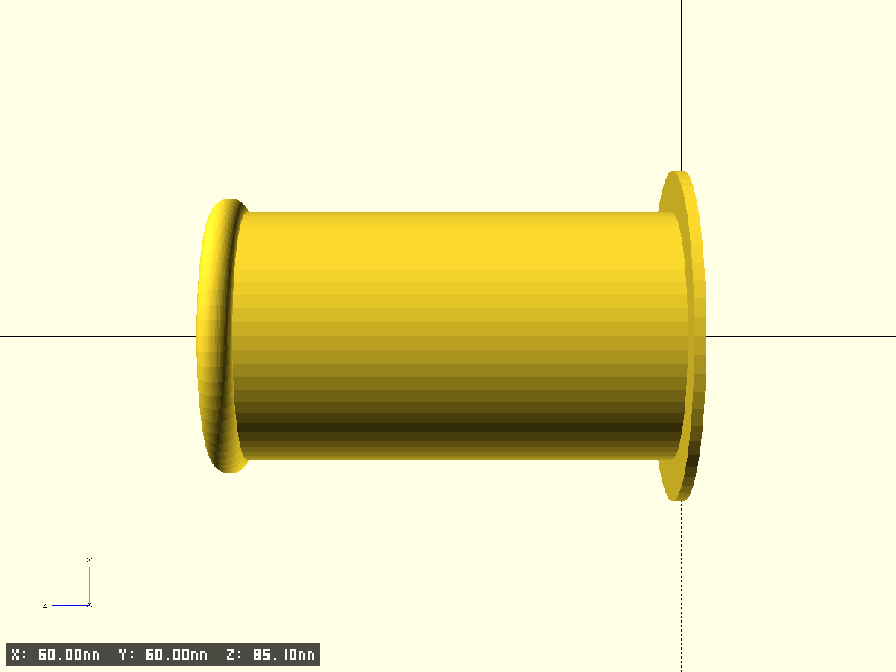

# filament holder

- Держатель катушки, крепится сбоку на принтер, на magsafe магнит
- Файл модели: `printer-filement-holder.scad`

## Ключевые параметры (см. начало SCAD)
- $fn, $fa, $fs, pin_fs — точность окружностей
- test_fragment, frag_* — тест‑фрагменты
- base_pad_d, base_pad_h — основание, Ø60×2 по ТЗ
- body_outer_d, body_h — труба, Ø45×77 по ТЗ
- wall_th — толщина стенки трубы (по умолчанию 2.0 мм, уточнить)
- hook_d, hook_h — верхний диск, Ø50×5 по ТЗ
- edge_ch — фаска верхнего края трубы (0 — без фаски)

## Фрагменты
- base — круглое основание (сплошной диск)
- body — основной корпус (полая трубка с настраиваемой фаской сверху)
- top_hook — верхний диск (сплошной)

Вывод деталей управляется флагами `print_base`, `print_body`, `print_top_hook`.

## Превью

