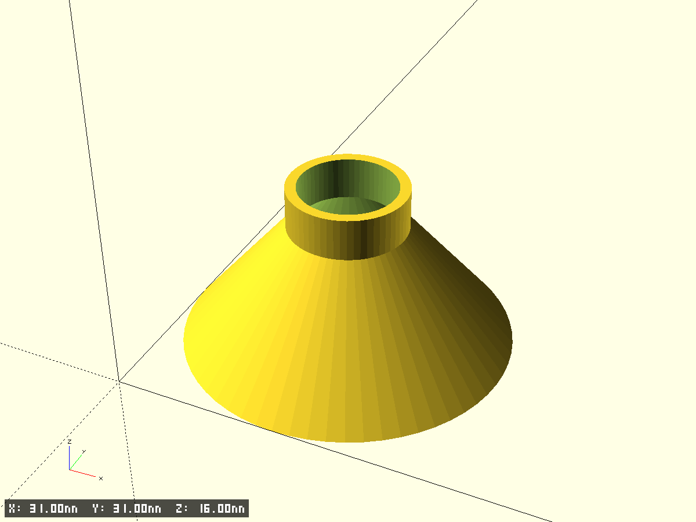
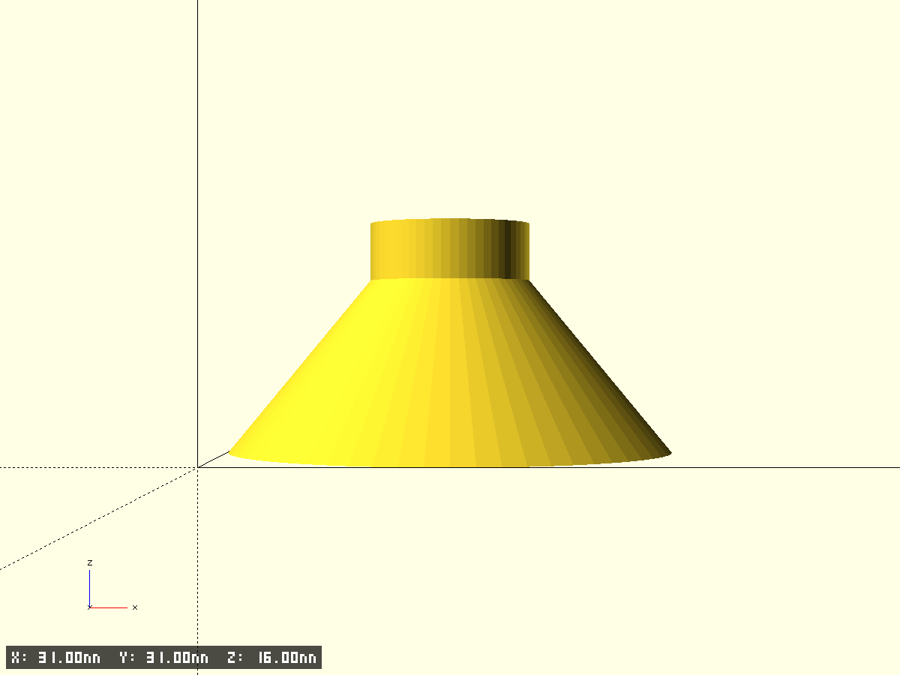

# funnel

- Файл модели: `funnel.scad`
- Версия: 1.0

## Фрагменты модели
- `p1_base` — нижнее основание (кольцо), параметры: `P1_D`, `P1_H`
- `p2_frustum` — конический участок, параметр: `P2_H` (диаметры берутся из `P1_D` и `P3_D`)
- `p3_neck` — горлышко (трубка), параметры: `P3_D`, `P3_H`
- Главная деталь: `base` = `p1_base + p2_frustum + p3_neck`

## Параметры (указать размеры)
Отметьте фактические значения по фото:
- `P1_D` — нижний внешний диаметр основания (мм)
- `P1_H` — высота основания (мм)
- `P2_H` — высота усечённого конуса (мм)
- `P3_D` — внешний диаметр горлышка (мм)
- `P3_H` — высота горлышка (мм)
- `wall_th` — толщина стенок (мм), по умолчанию 2.0
- `edge_ch_base`, `edge_ch_neck` — фаски по краям (мм), опционально
- `mink_r` — глобальное скругление мидов (мм), опционально

## Технические настройки
- `$fn=0`, `$fa=6`, `$fs=0.35`, `pin_fs=0.25`
- `test_fragment`, `frag_*` — поддержка тест‑фрагментов из `models/modules.scad`

## Превью

