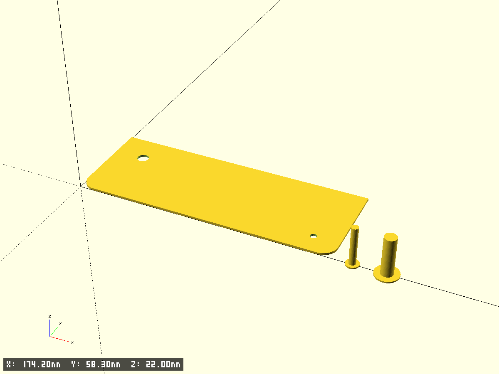
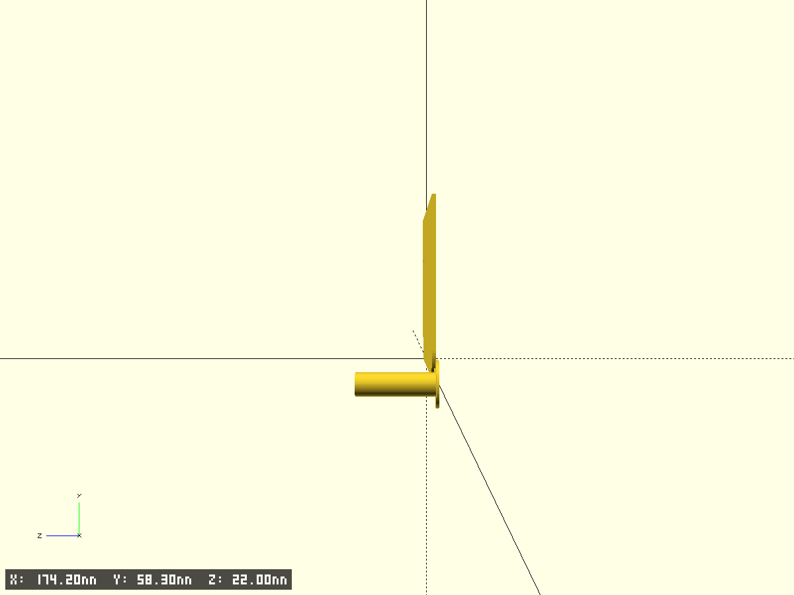

# nux mighty air cover

- Файл модели: `nux-cover.scad`
- Версия: 1.0

## Описание
Тонкая крышка 140.9×52×1 мм, скругление только по нижним углам (R5). Два сквозных отверстия.

## Ключевые параметры (см. начало SCAD)
- $fn, $fa, $fs, pin_fs — точность окружностей
- test_fragment, frag_* — тест‑фрагменты
- edge_chamfer_*, tiny — фаски/совм.

## Размеры
- Основание: X=140.9 мм, Y=52 мм, Z=1 мм
- Скругление по min Y: R=5 мм
- Большое отверстие: (x=16.9, y=36) мм, d=6.3 мм
- Малое отверстие: (x=127, y=11) мм, d=3.5 мм

## Фрагменты
- base_plate — сама пластина со скруглением только внизу (реализовано как `cover()`)
- holes — два отверстия (булево вычитание)

## Превью

