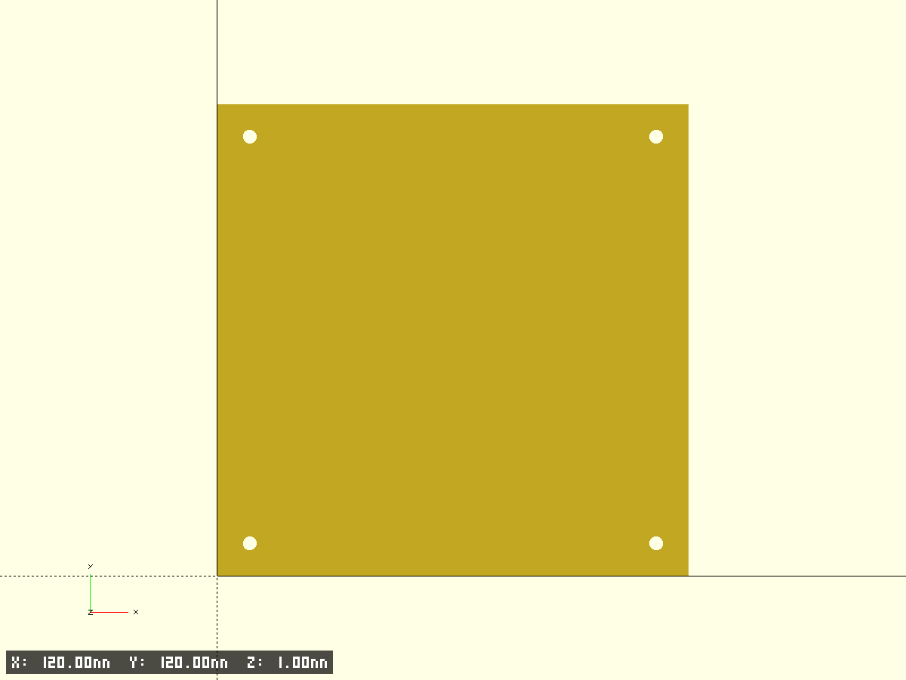
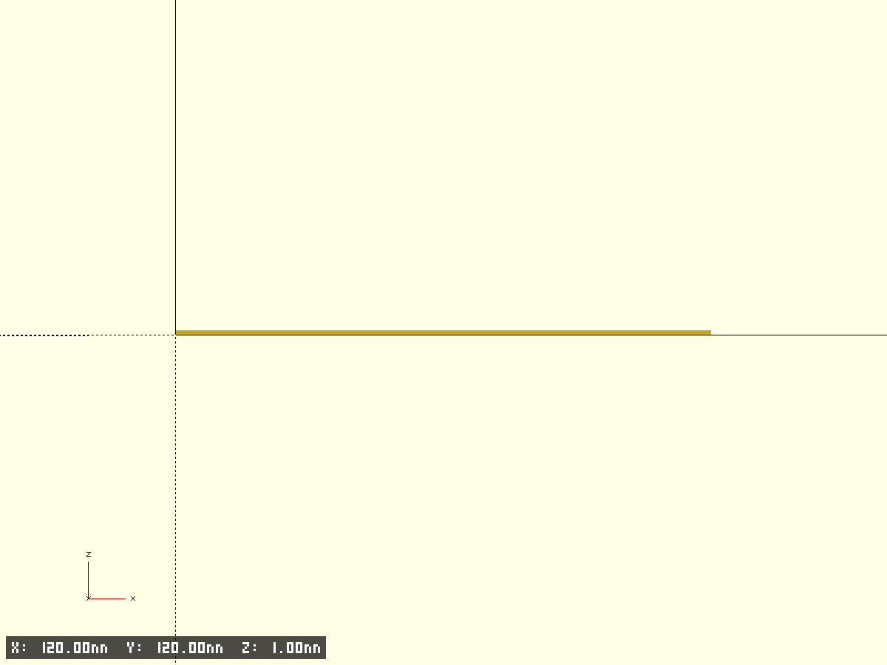

# ventilation stub

- Файл модели: `ventilation-stub.scad`
- Версия: 1.0

## Описание
Плоская плита 120×120×2 мм с 4 отверстиями Ø3.5 мм. Расстояние между центрами отверстий 103.5 мм по обоим осям.

## Фрагменты
- base: основная деталь (плита с отверстиями)
- plate_body: тело плиты
- mount_holes: 4 крепёжных отверстия

## Ключевые параметры (см. начало SCAD)
- $fn, $fa, $fs, pin_fs — точность окружностей
- test_fragment, frag_* — тест‑фрагменты
- edge_chamfer_*, tiny — фаски/совм.

Основные размеры:
- `plate_x`, `plate_y` — 120×120 мм
- `base_h` — толщина 2 мм
- `hole_diam` — Ø3.5 мм
- `holes_spacing` — 103.5 мм (между центрами по X и Y)

## Превью

