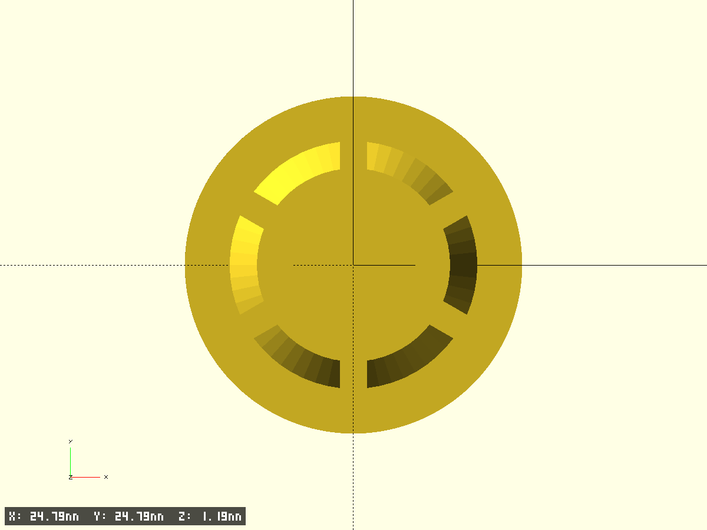
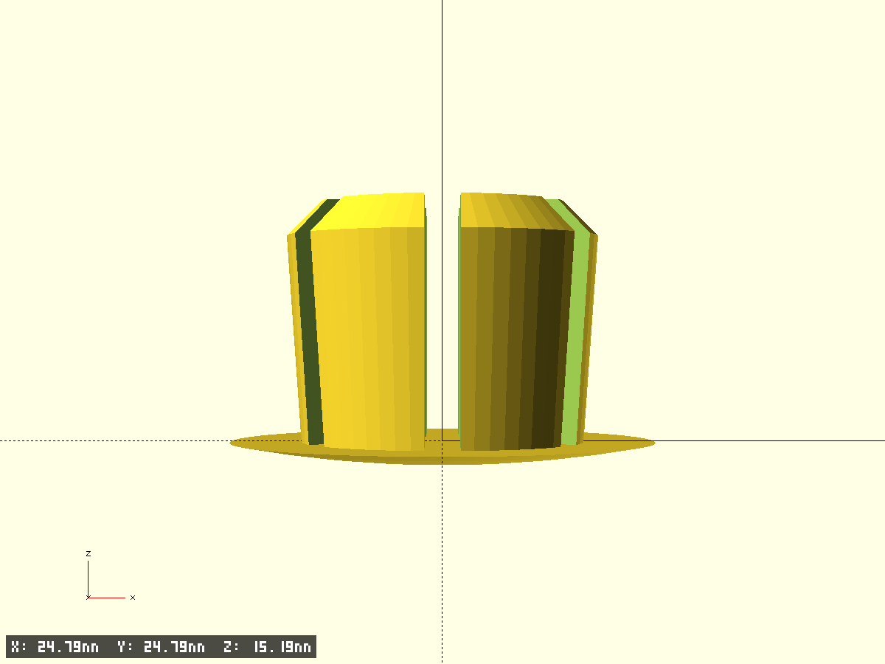
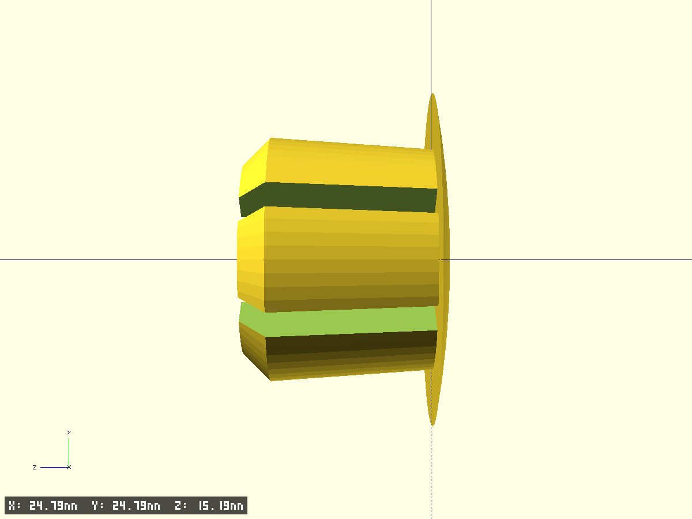

# Handlebar stub (заглушка руля)

- Файл модели: `hanlebar-stub.scad`
- Версия: 1.0

## Фрагменты модели
- **cap**: внешняя сферическая шапка (сферический сегмент). Параметры: `cap_d_outer`, `cap_h`, `cap_shell_th`, `cap_plate_th`.
- **petals_ring**: кольцо‑втулка с лепестками (разрезы по окружности). Конус от `insert_d_top` к `insert_d_bottom`, высота `insert_h`, снизу фаска `petal_ch`.
- **base**: сборка `cap + petals_ring`.

## Ключевые параметры (см. начало SCAD)
- **Точность**: `$fn`, `$fa`, `$fs`, `pin_fs`
- **Тест‑фрагменты**: `test_fragment`, `frag_*`
- **Фаски/служебные**: `edge_chamfer_*`, `tiny`

## Что нужно уточнить (для точной посадки)
- Внутренний диаметр трубы руля (ожидаемо 18.0 мм — подтверждите/уточните допуск).
- Высота вставляемой части `insert_h` (на фото ~12–15 мм?).
- Число лепестков `petals_n` (на фото похоже 6) и желаемая ширина прорезей `slot_w_mm`.
- Толщина шапки (оболочки) `cap_shell_th` и толщину нижней пластины `cap_plate_th`.

## Превью

