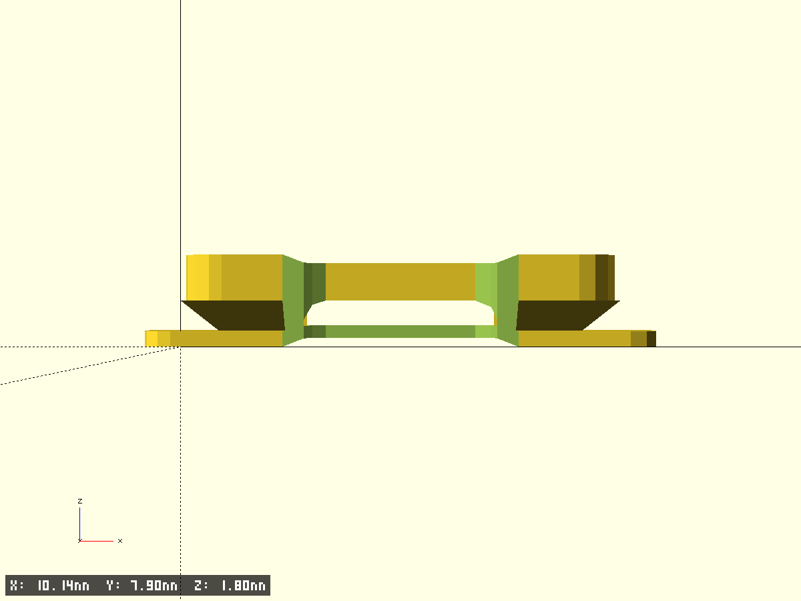
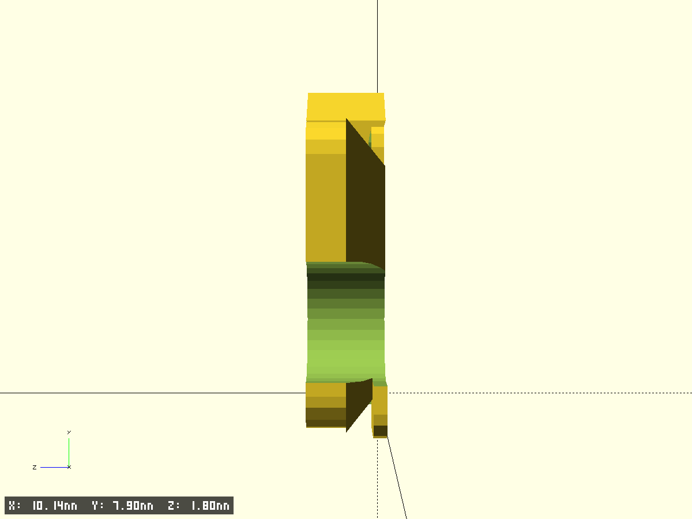

# Pressure Pad Lifter (PETG)

- Файл модели: `pad-lifter.scad`
- Версия: 1.0

## Назначение
Параметрическая рамка‑лифтер вокруг головки воспроизведения. В положении Play отводит прижимную подушку кассеты от «лица» головы на A=0.8–1.2 мм, лента не касается рамки (контрольный зазор ≥ 0.30 мм). Установка на штатный кронштейн, не перекрывает доступ к регулировочным винтам.

## Параметры модели (все мм)
- `W_head` — ширина рабочей части головы (по умолчанию 4.0)
- `H_head` — высота корпуса в зоне окна (9.0)
- `A` — вынос скосов вперёд от плоскости «лица» головы (0.8, диапазон 0.5–1.1)
- `B_deg` — угол скоса «щёк» (25/30/35°)
- `C_gap` — суммарный боковой зазор окна к голове (≥0.6)
- `D_radius` — радиусы скруглений кромок контакта с подушкой (R0.5–R1.0)
- `t` — толщина рамки (1.6–2.0; по умолчанию 1.8)
- `depth_y` — глубина рамки вдоль движения ленты (6–8)
- `screw_pitch` — межосевое расстояние крепёжных отверстий (9–14)
- `screw_diameter` — М2 или М2.5; `both_screw_variants` для вырезания обоих
- `clearance_tape` — минимальный зазор до ленты (≥0.30)

Точность/служебные:
- `$fn/$fa/$fs/pin_fs` — точность окружностей (см. шаблон)
- `test_fragment/frag_*` — режим тест‑фрагментов
- `edge_chamfer_*`, `tiny`, `screen_frame_gap` — фаски, техзазоры

## Фрагменты модели
- `base` — основная рамка: внешняя плита с радиусами, внутреннее окно, две «щёки» с выносом `A`, продольные пазы под винты, три микроподпятника снизу.

## Геометрия и кинематика
- Внутреннее окно: `(W_head + C_gap) × (H_head + C_gap)` со скруглением `D_radius`.
- Щёки: треугольники у боковых граней окна с углом `B_deg`, выступ спереди `A`. Первыми касаются фетровая подушка/рамка, лента защищена.
- Глубина: `depth_y` (6–8). Внешние углы `outer_corner_r`.
- Подпятники снизу: 3 шт, высота `pad_h=0.3` для стабильной посадки/VHB.
- Пазы: длина 4.0 мм; ширина 2.2 мм (М2) или 2.7 мм (М2.5); расстояние `screw_pitch`.

## Печать (PETG)
- Сопло 0.4 мм; слой 0.20 (финал) / 0.28 (черновик); периметры ≥ 4; верх/низ ≥ 5 слоёв; заполнение 40–60%.
- Вентилятор 20–40% после первых слоёв. Адгезия — стекло/PEI/скотч, «слон» 0.1 мм при необходимости.
- Окно под голову имеет припуск +0.10 мм по X и Z на калибровку принтера.
- Постобработка: лёгкая шлифовка кромок (P600→P1000), сухая полировка. Пламя/химия — не требуется.

## Монтаж
- Базовый: через штатные винты+проставки 0.3/0.5/0.8/1.0 мм для настройки A.
- Альтернативный: VHB 0.3–0.5 мм с упором от сдвига (если винты трогать нельзя).
- Не перекрывать доступ к регулировочным винтам головы; опционально `both_screw_variants=true`.

## Контроль/приёмка
- В «Play» подушка уходит назад на 0.8–1.2 мм по центру окна.
- Щёточная кассета не упирается в голову.
- Щуп 0.30 мм проходит везде между траекторией ленты и кромками лифтера.
- После 30 мин работы — нет следов контакта ленты/рамки, фаски целые.

## Экспорт и пресеты
- Предпросмотр: `openscad models/2025-10-03-pressure-pad-lifter/pad-lifter.scad`
- Экспорт STL (пресет):
  - М2.5: `openscad -D W_head=4 -D H_head=9 -D A=0.8 -D B_deg=30 -D C_gap=0.6 -D D_radius=0.5 -D t=1.8 -D screw_pitch=12 -D screw_diameter=2.5 -o models/2025-10-03-pressure-pad-lifter/pad-lifter.stl models/2025-10-03-pressure-pad-lifter/pad-lifter.scad`
- Для М2: заменить `-D screw_diameter=2.0` или `-D both_screw_variants=true`.

## Чек‑лист измерений перед финалом
- W_head, H_head — по вашей деке
- screw_pitch и screw_diameter — по факту
- Свободное пространство вокруг головы; положение «лица» в Play — подтвердить A

## Превью

