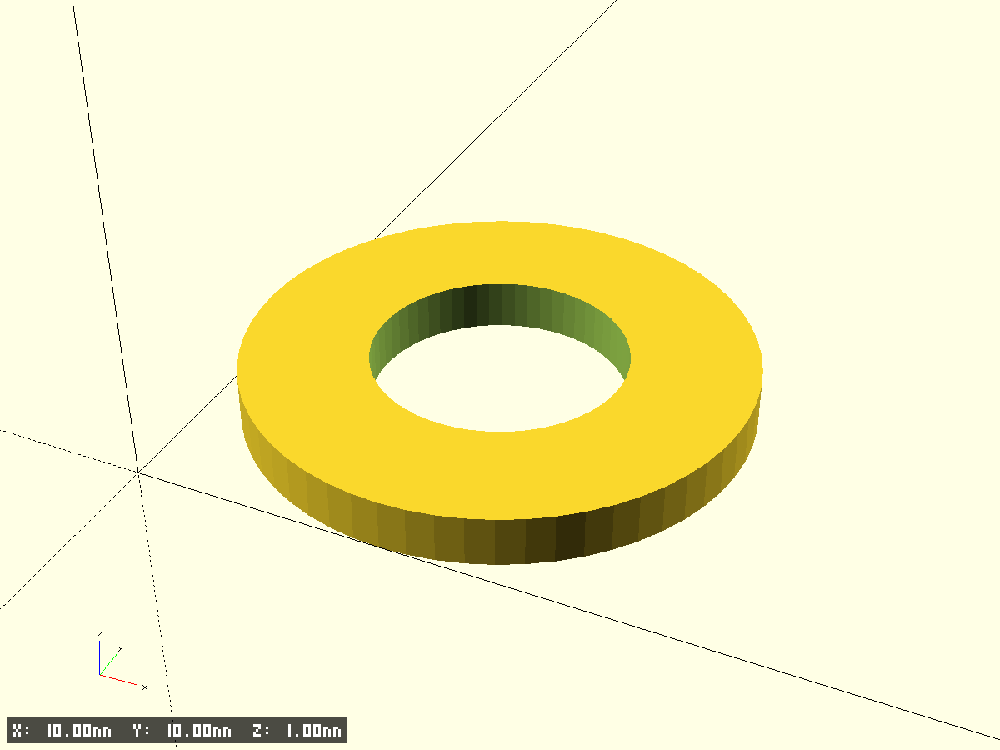
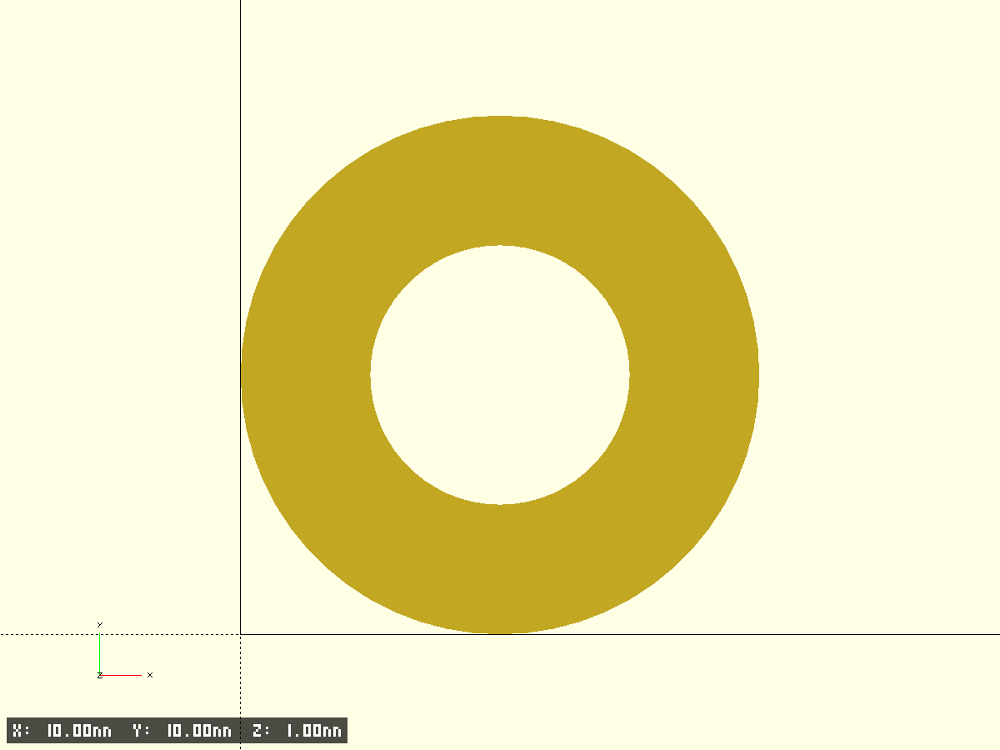
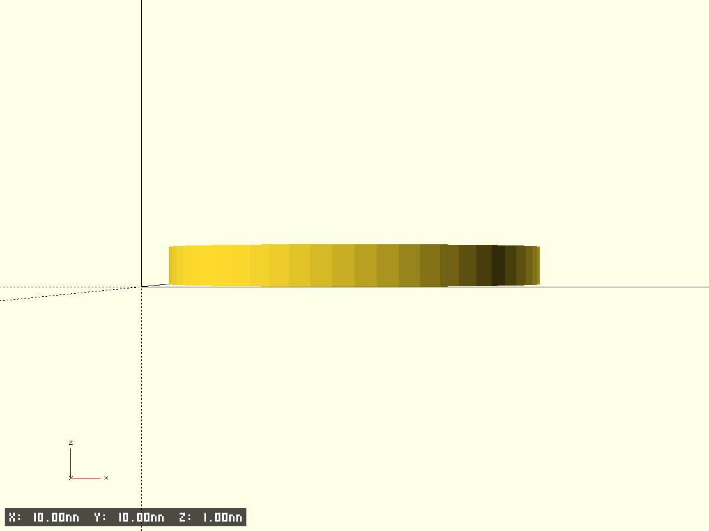
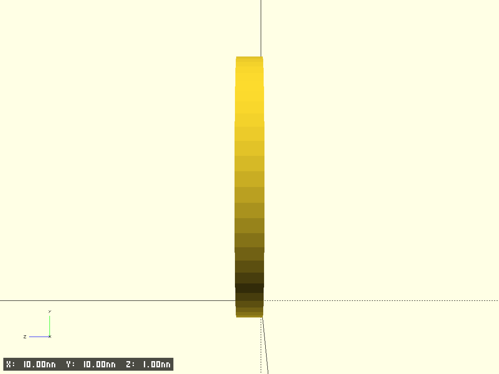

# washer 10x5x1

- Файл модели: `washer-10x5x1.scad`
- Версия: 1.0

## Описание
Плоская шайба: внешний диаметр 10 мм, внутренний диаметр 5 мм, толщина 1 мм. Верхняя фаска регулируется параметром `edge_chamfer_z` (по умолчанию 0).

## Фрагменты
- `base` — основная шайба

## Ключевые параметры (см. начало SCAD)
- $fn, $fa, $fs, pin_fs — точность окружностей
- test_fragment, frag_* — тест‑фрагменты (используется `clip_for_fragments_bbox`)
- edge_chamfer_z — высота фаски по Z; tiny — технологический зазор
- outer_d, inner_d, thickness — габариты шайбы

## Превью

