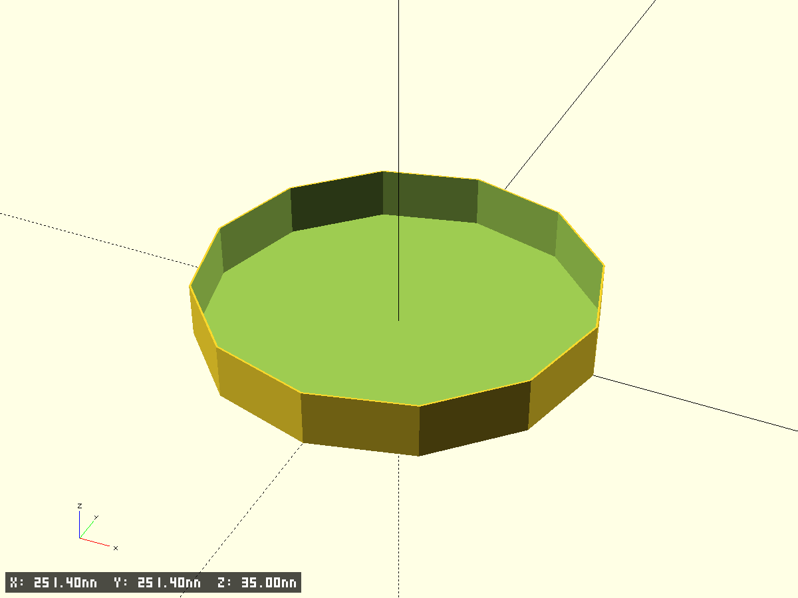
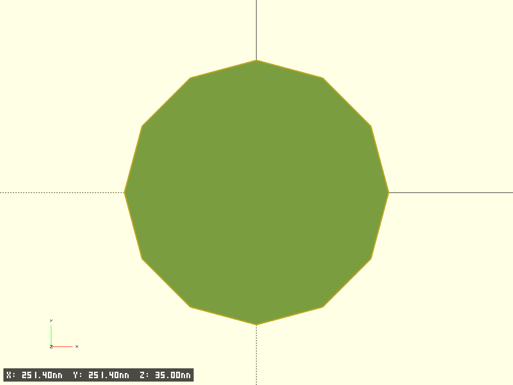
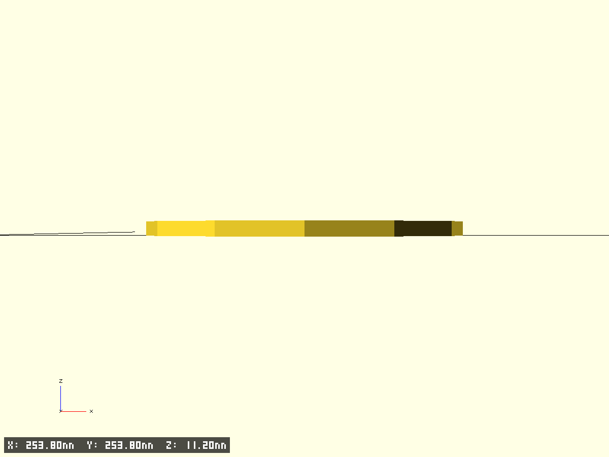
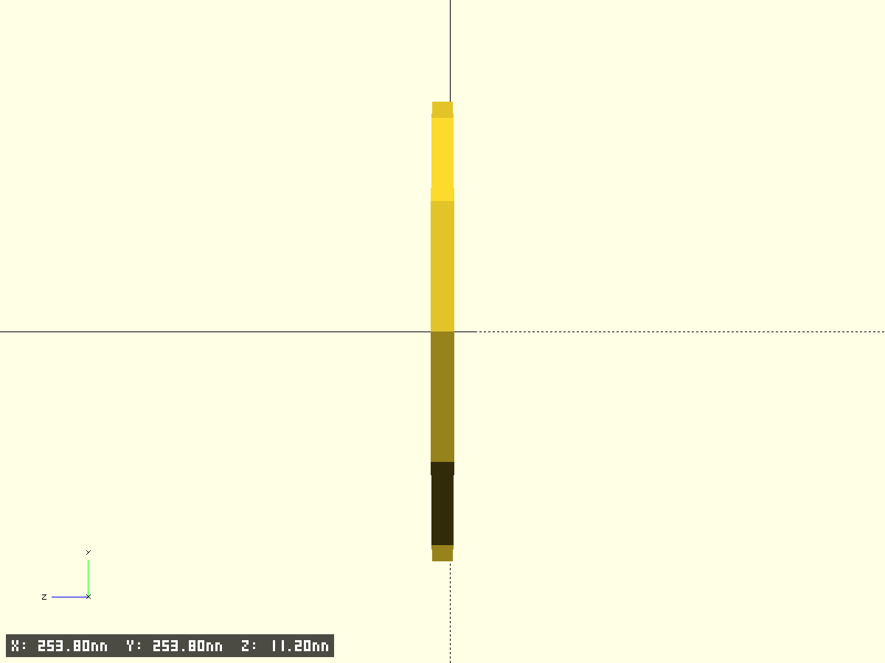

# Round Box

Круглая коробка с крышкой для хранения.

- Файл модели: `round-box.scad`
- Версия: 1.0

## Параметры
- Внутренний диаметр коробки: 250 мм
- Высота коробки: 35 мм
- Толщина стенок: 1 мм
- Зазор посадки крышки: `cap_fit_gap` (по умолчанию 0.2 мм)

## Фрагменты модели
- `base` — коробка: цилиндрический контейнер с дном и стенками
- `cap` — крышка: плоский диск с цилиндрической юбкой, надевается на коробку

## Рендер и тестовые вырезки
Включите/отключите `test_fragment` для печати тестовых вырезок. Параметры вырезок:
- `frag_size` — размер квадрата вырезки (мм)
- `frag_index` — индекс сектора (0=НЛ, 1=ВЛ, 2=НП, 3=ВП)
- `frag_gap_x` — зазор между фрагментами по X (мм)
- `frag_h_extra` — дополнительная высота клипа (мм)

## Превью

