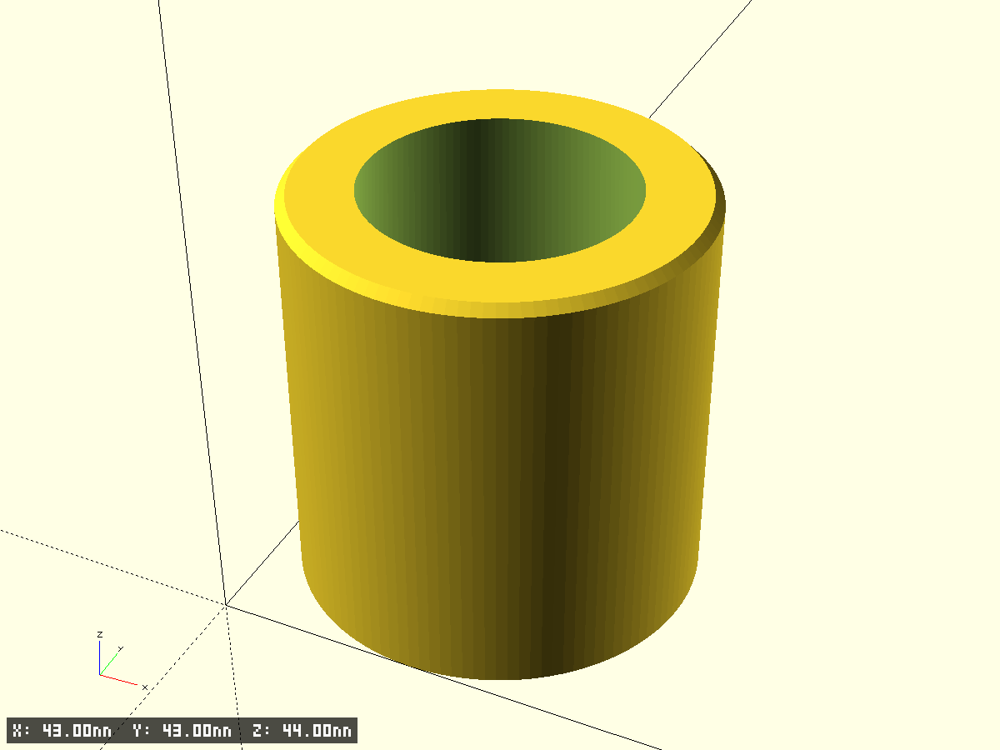
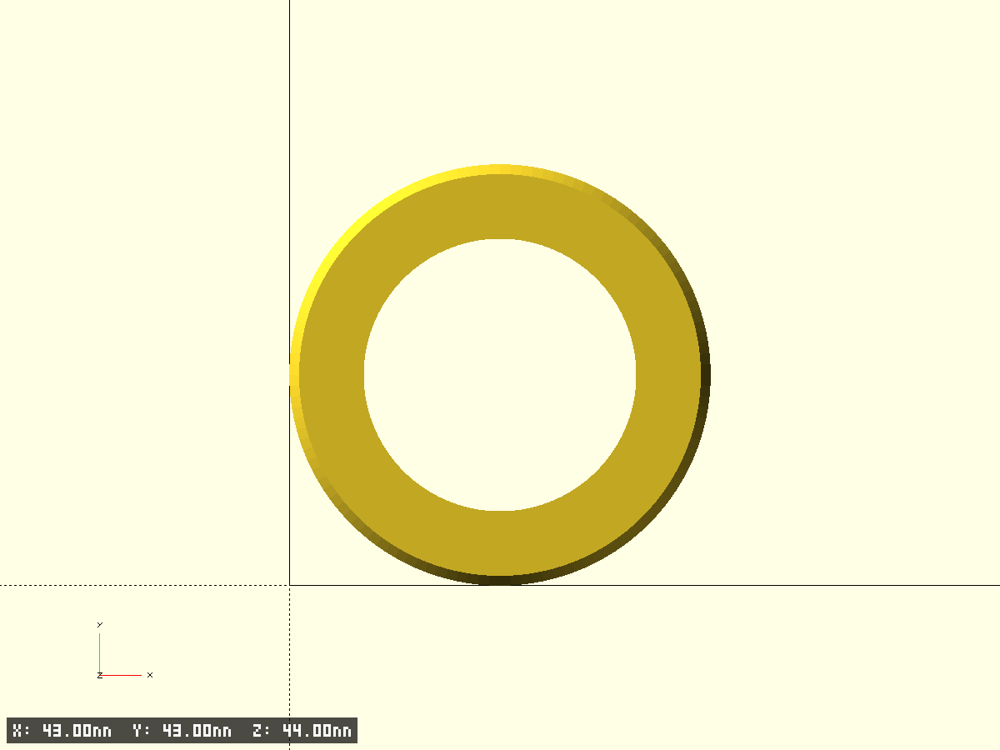
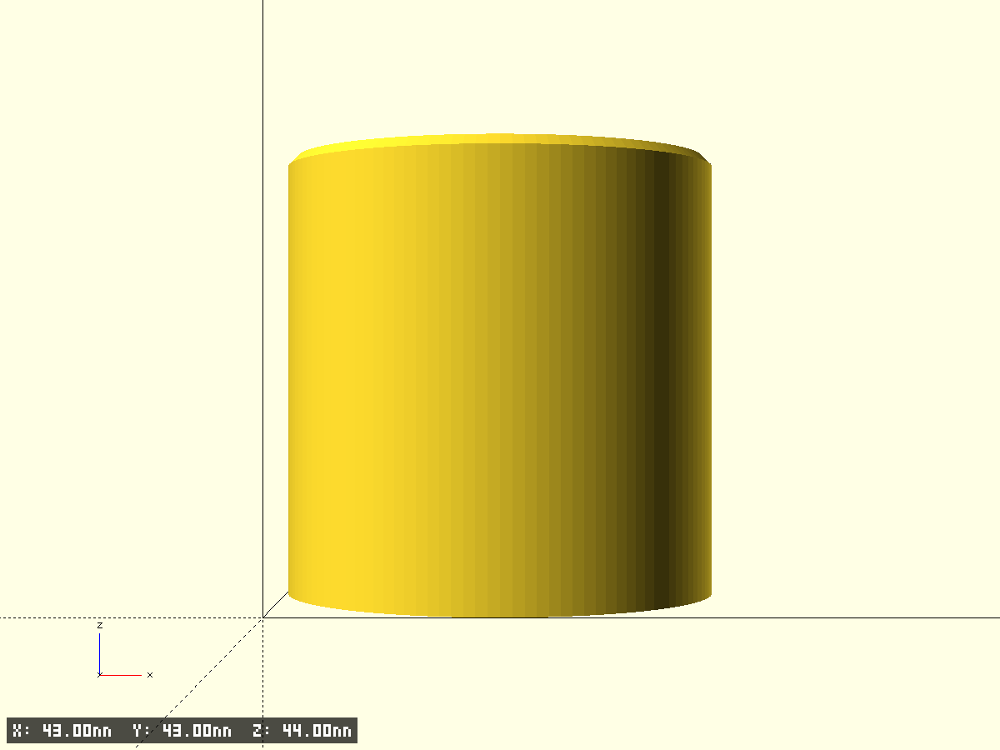
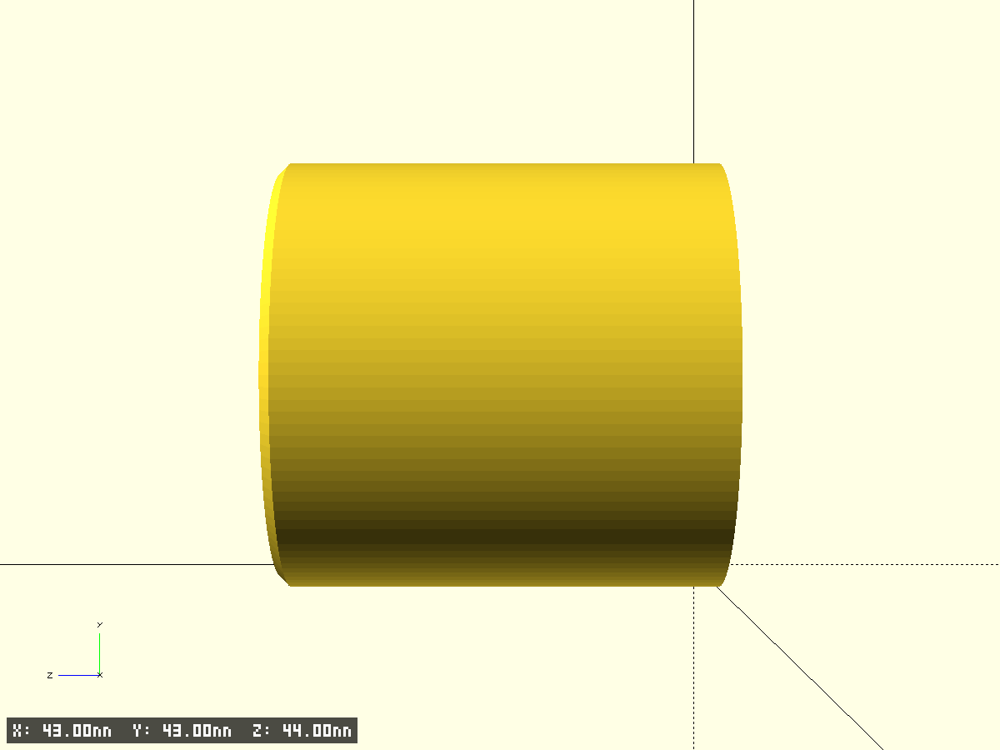

# microphone adapter

- Файл модели: `microphone-adapter.scad`
- Версия: 1.0

## Описание
Цилиндрический адаптер для микрофона с коническим внутренним отверстием. Внешний диаметр 43 мм, высота 44 мм. Внутреннее отверстие меняет диаметр: 40 мм внизу, 30 мм на высоте 18 мм, 27.8 мм на высоте 44 мм (вверху).

## Фрагменты модели
- **base**: основная деталь — цилиндрический адаптер с коническим внутренним отверстием

## Ключевые параметры (см. начало SCAD)
- $fn, $fa, $fs, pin_fs — точность окружностей
- test_fragment, frag_* — тест‑фрагменты (используется `clip_for_fragments_bbox`)
- edge_chamfer_z — высота фаски по верхней кромке (скругление углов); tiny — технологический зазор
- outer_d, height — внешний диаметр и высота адаптера
- inner_d_bottom, inner_d_mid, inner_d_top — диаметры внутреннего отверстия на разных уровнях

## Превью

