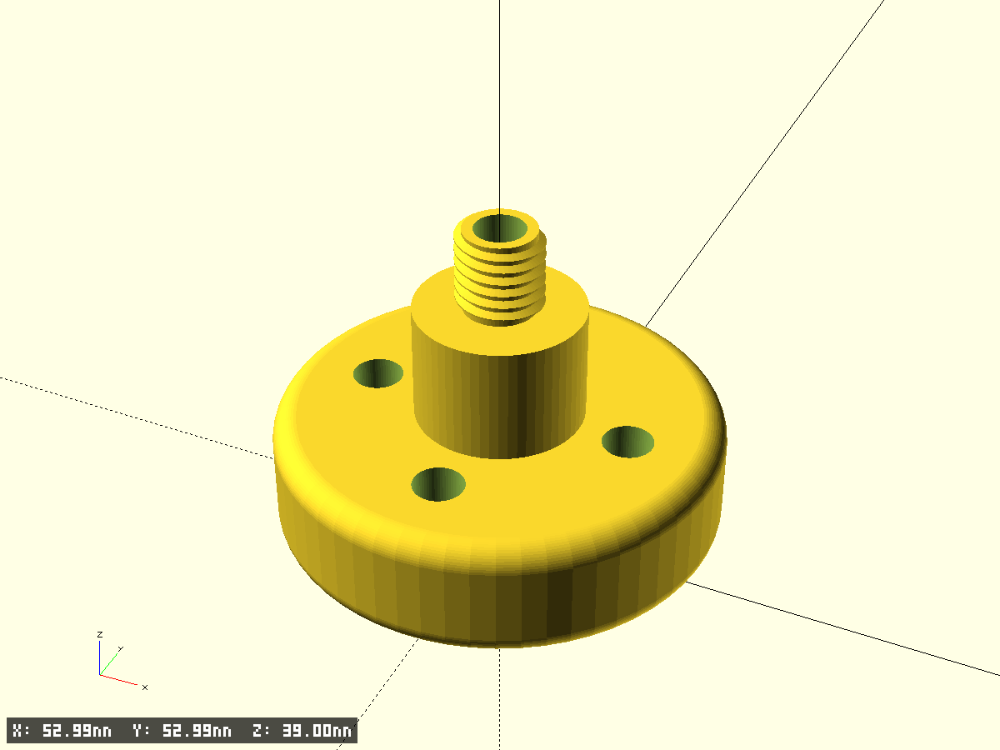
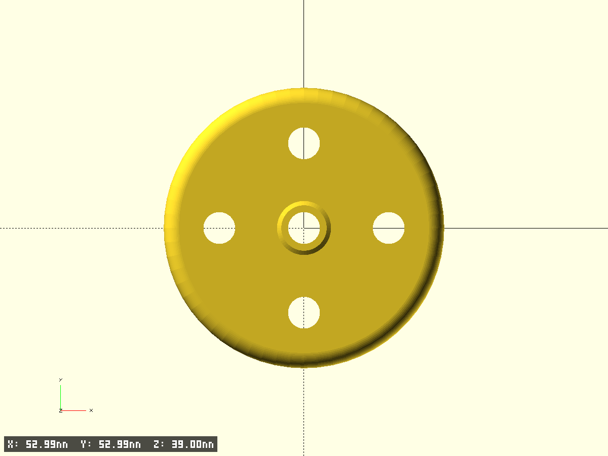
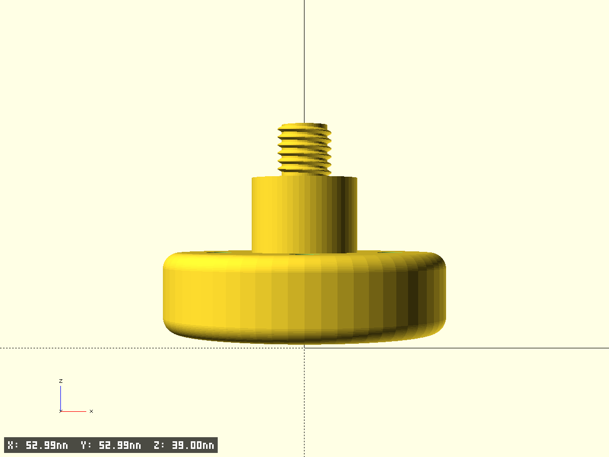
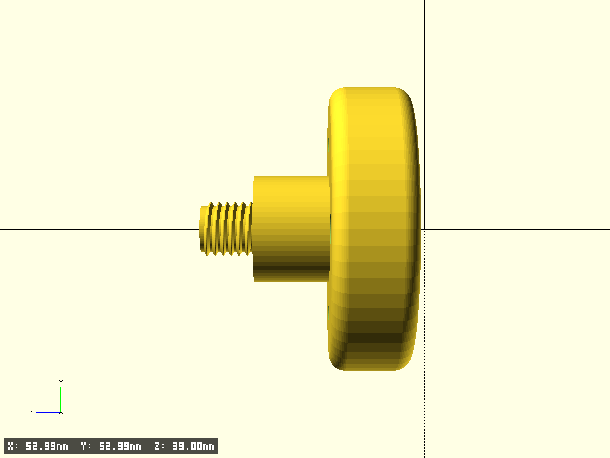

# Propane Connector

Соединитель для пропанового баллона с резьбой M8 x 1.5.

- Файл модели: `propane-connector.scad`
- Версия: 1.0

## Параметры
- Резьба: M8 x 1.5 (диаметр 8 мм, шаг 1.5 мм)
- Средний цилиндр: диаметр 20 мм, высота 32 мм
- Нижний цилиндр: внешний диаметр 53 мм, высота 15 мм, толщина стенок 5 мм

## Фрагменты модели
- `thread_section` — резьбовая секция M8 x 1.5 в верхней части
- `middle_cylinder` — средний цилиндр диаметром 20 мм, высотой 32 мм
- `bottom_cylinder` — нижний полый цилиндр диаметром 53 мм, высотой 15 мм, толщиной стенок 5 мм

## Рендер и тестовые вырезки
Включите/отключите `test_fragment` для печати тестовых вырезок. Параметры вырезок:
- `frag_size` — размер квадрата вырезки (мм)
- `frag_index` — индекс сектора (0=НЛ, 1=ВЛ, 2=НП, 3=ВП)
- `frag_gap_x` — зазор между фрагментами по X (мм)
- `frag_h_extra` — дополнительная высота клипа (мм)

## Превью

