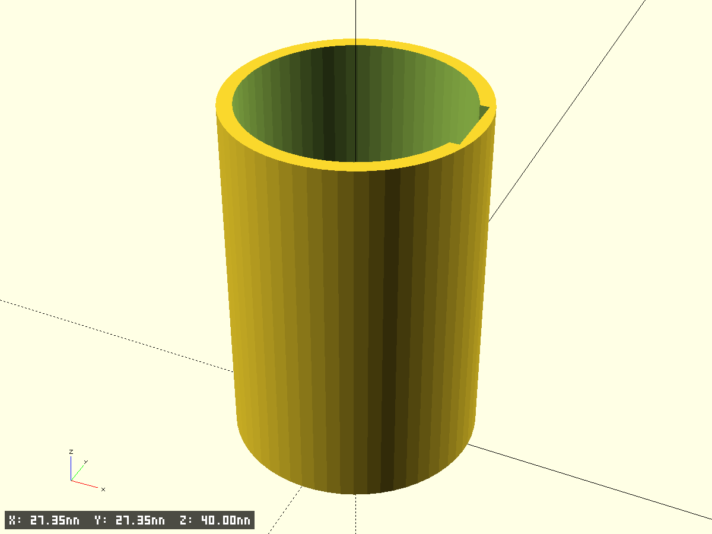
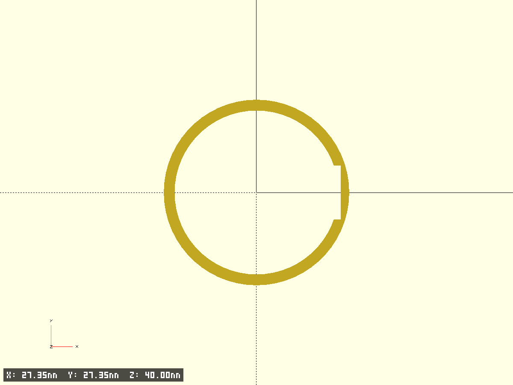
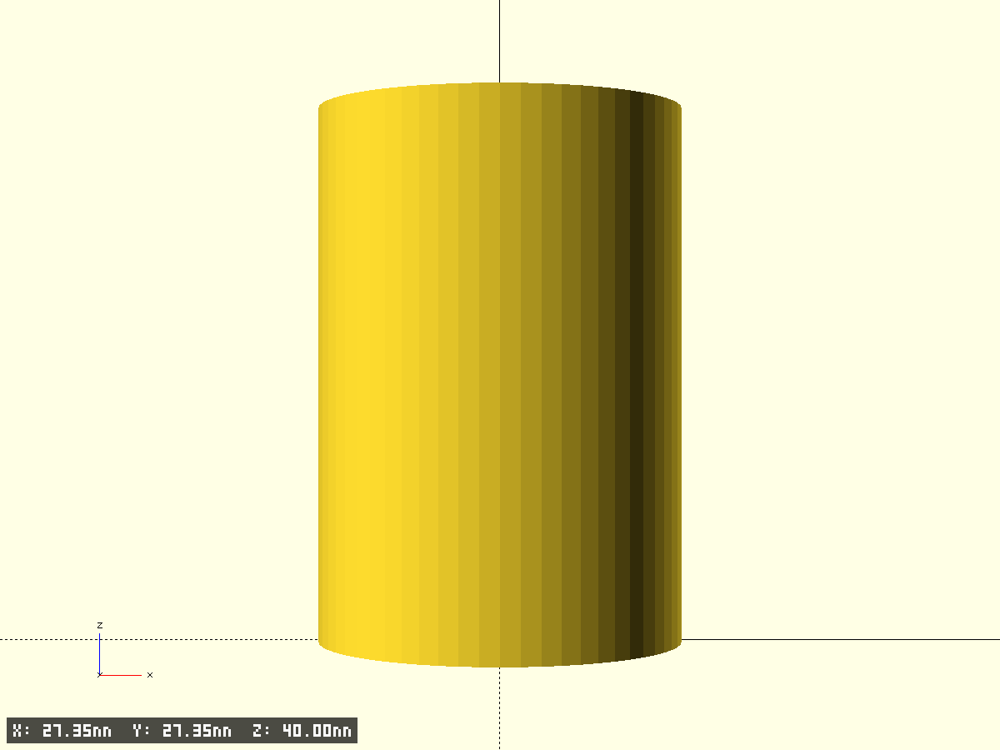
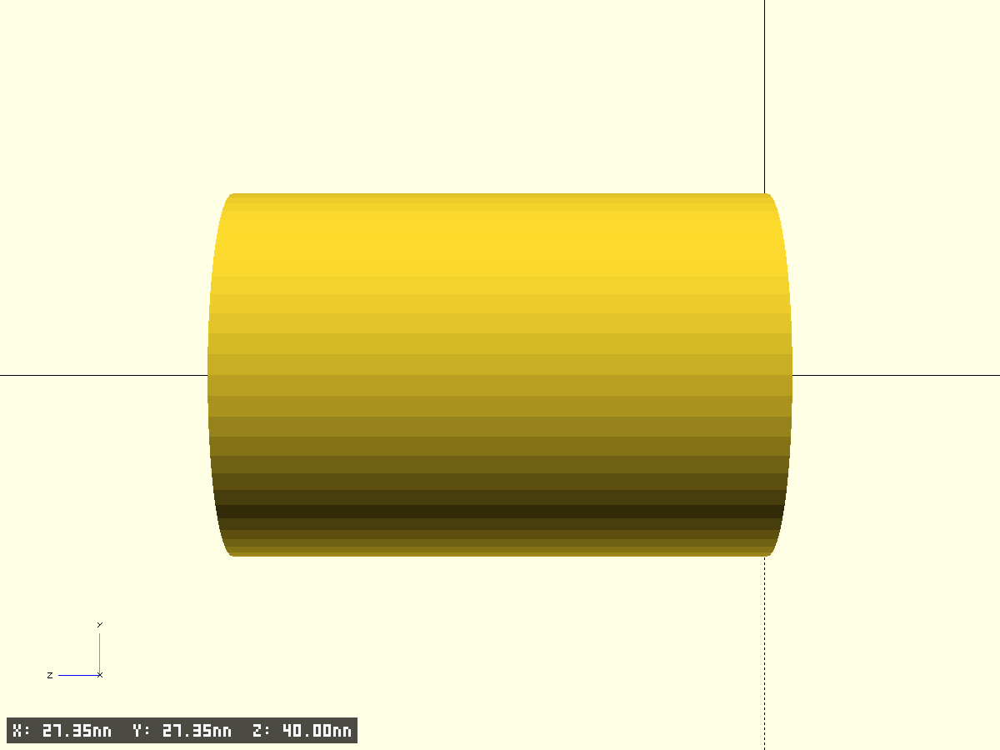

# screwdriver button blocker

Цилиндрическая втулка, которая надевается на отвёртку и блокирует нажатие кнопок.

- Файл модели: `button-blocker.scad`
- Версия: 1.0

## Описание модели

Цилиндрическая трубка с внутренним диаметром 23.8 мм, длиной 40 мм и толщиной стенки 1.2 мм. В стенке цилиндра вырезан паз (notch) для доступа к кнопкам отвёртки.

## Фрагменты модели

- **base**: основной цилиндр с внутренним отверстием
- **notch**: прямоугольный вырез в стенке цилиндра (difference)

## Ключевые параметры (см. начало SCAD)

- `inner_diameter = 23.8` - внутренний диаметр цилиндра, мм
- `length = 40` - длина цилиндра, мм
- `wall_thickness = 1.2` - толщина стенки, мм
- `notch_length = 34` - длина паза по оси цилиндра, мм
- `notch_width = 7` - ширина паза по окружности, мм
- `notch_depth = 0.5` - глубина паза в стенку, мм
- `$fn, $fa, $fs, pin_fs` — точность окружностей
- `test_fragment, frag_*` — тест‑фрагменты
- `edge_chamfer_*, tiny` — фаски/совм.

## Полезные приёмы OpenSCAD

### 1. Создание полого цилиндра через difference
```scad
difference() {
    cylinder(h=length, d=outer_diameter, $fs=pin_fs, $fa=6);
    translate([0, 0, -tiny])
        cylinder(h=length + 2*tiny, d=inner_diameter, $fs=pin_fs, $fa=6);
}
```
**Приём**: Использование difference для создания полого цилиндра. Добавление `tiny` зазора гарантирует корректное вычитание.

### 2. Вырез паза в цилиндрической стенке
```scad
translate([0, 0, notch_offset])
    rotate([0, 0, 0])
        translate([outer_radius - notch_depth, 0, 0])
            cube([notch_depth + tiny, notch_width, notch_length], center=true);
```
**Приём**: Создание прямоугольного выреза в цилиндрической стенке через cube с правильным позиционированием относительно радиуса цилиндра.

## Параметры для настройки

### Основные размеры
- `inner_diameter = 23.8` - внутренний диаметр (под отвёртку), мм
- `length = 40` - длина цилиндра, мм
- `wall_thickness = 1.2` - толщина стенки, мм

### Параметры паза
- `notch_length = 34` - длина паза по оси, мм
- `notch_width = 7` - ширина паза по окружности, мм
- `notch_depth = 0.5` - глубина паза в стенку, мм
- `notch_offset = 3` - смещение паза от начала цилиндра, мм

## Советы по печати

1. **Ориентация**: Печатайте вертикально (цилиндр стоит на торце) для лучшего качества внутренней поверхности
2. **Поддержки**: Обычно не требуются
3. **Точность**: Используйте `$fs = 0.35` для сопла 0.4мм
4. **Тестирование**: Сначала напечатайте фрагмент (`test_fragment = true`) для проверки посадки на отвёртку

## Превью








