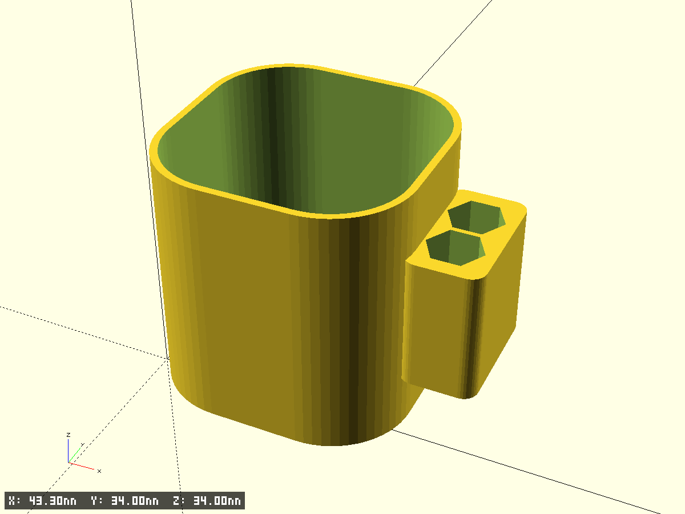
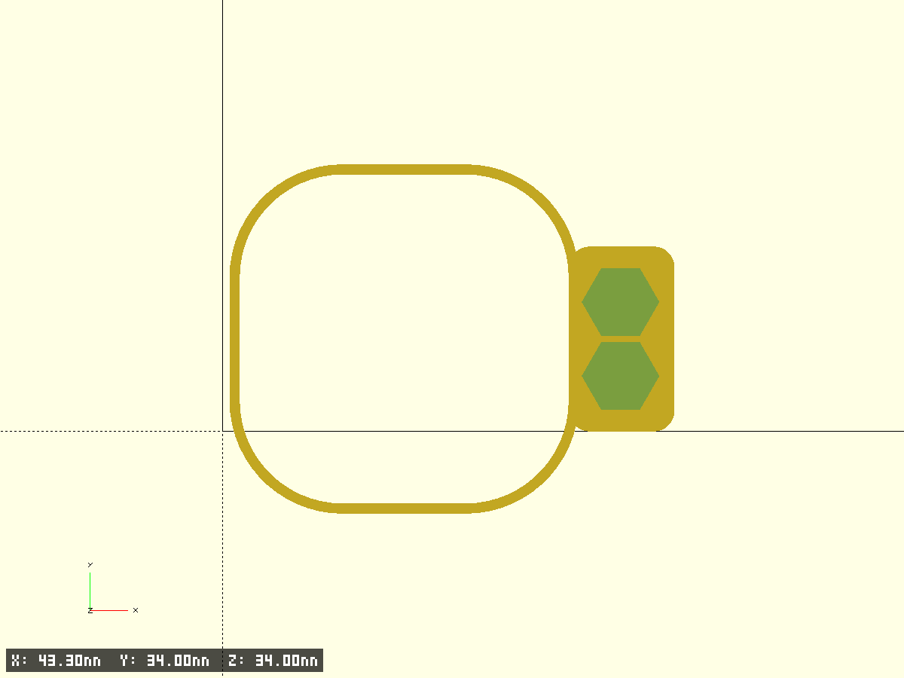
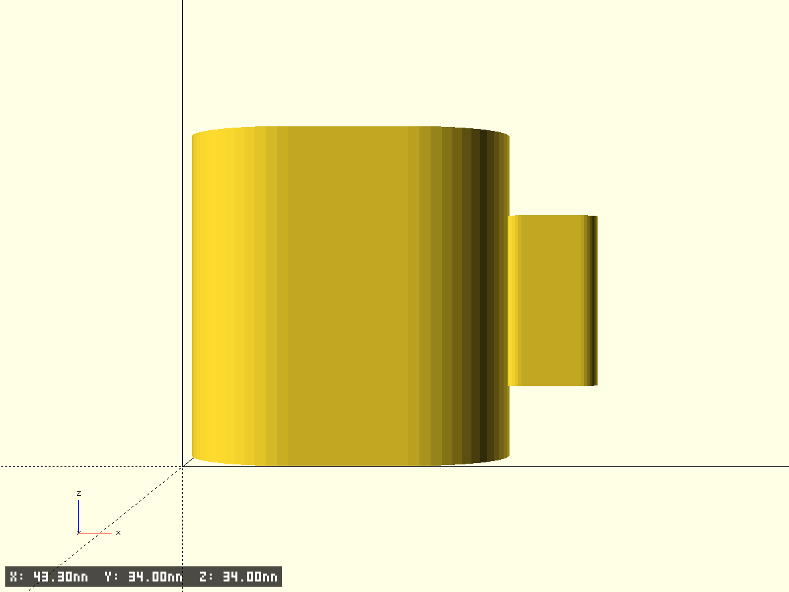
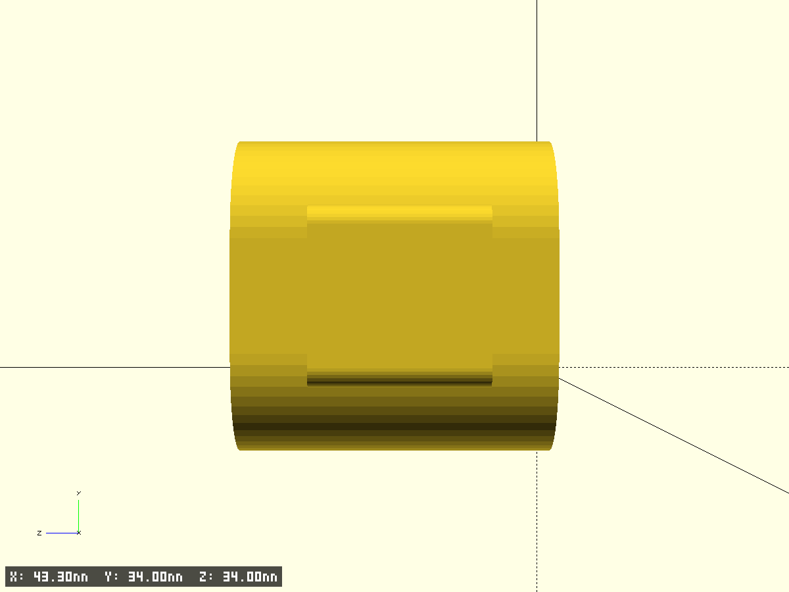

# screwdriver holder

- Файл модели: `screwdriver-holder.scad`
- Версия: 1.0
- Назначение: держатель с «скорлупой» под цилиндр/рукоятку и боковым блоком крепления с шестигранными отверстиями

## Фрагменты модели

- `shell_wall` — основная скорлупа без дна:
  - высота `35 мм`
  - внутренний контур: скруглённый прямоугольник `34 × 34 мм`
  - внутренний радиус скругления `5 мм`
- `holder_block` — боковой блок на внешней стенке:
  - габариты `17 × 17 × 10 мм`
  - располагается по центру выбранной стенки (`holder_face`)
- `holder_hex_cut` — отверстия в блоке:
  - 2 сквозных шестигранных отверстия по оси Z
  - размер шестигранника: расстояние между параллельными гранями `6 мм`
  - расположение: по горизонтали (рядом в плане)

## Параметры, которые обычно меняют

- `wall_th` — толщина стенки скорлупы (`1 мм`)
- `shell_bottom_th` — толщина дна (`0`, дно отключено)
- `holder_face` — сторона крепления блока (`x_plus | x_minus | y_plus | y_minus`)
- `edge_chamfer_z`, `edge_chamfer_x`, `edge_chamfer_y` — фаски внешнего контура
- `test_fragment`, `frag_*` — печать тест‑фрагментов

## Превью

