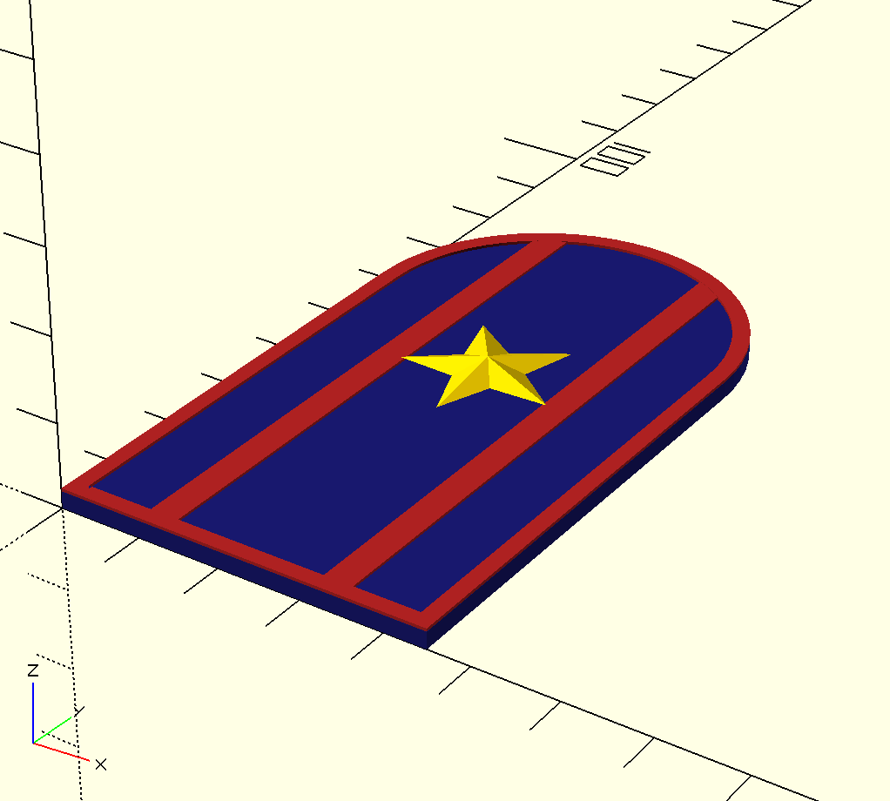
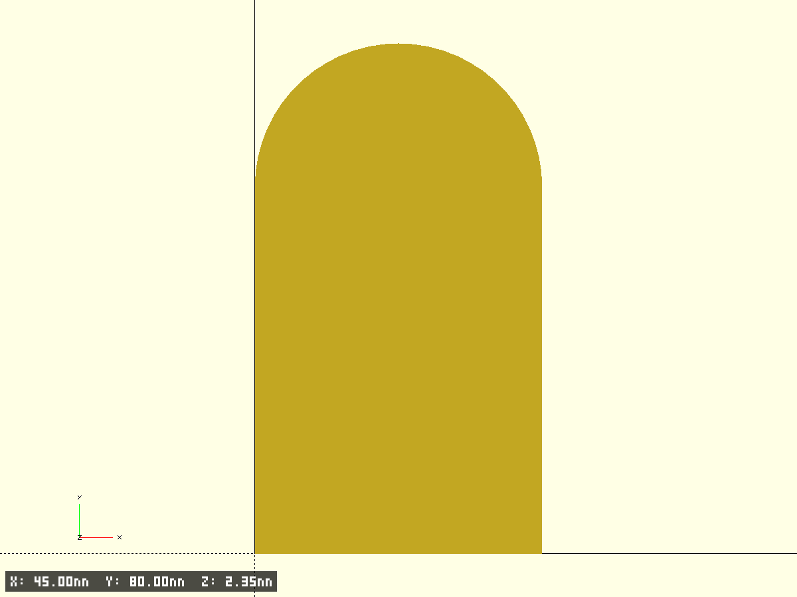
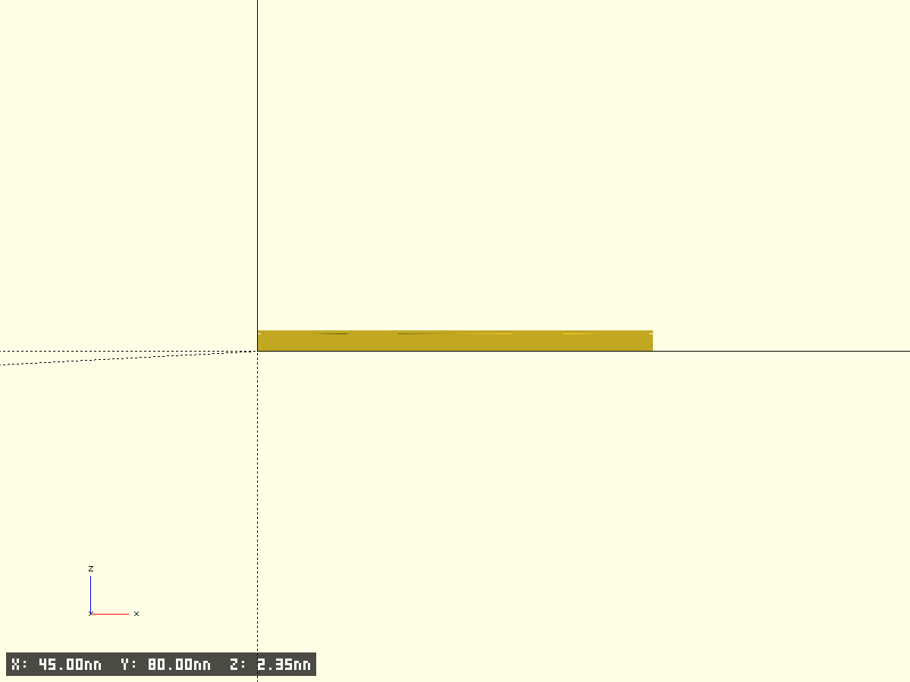
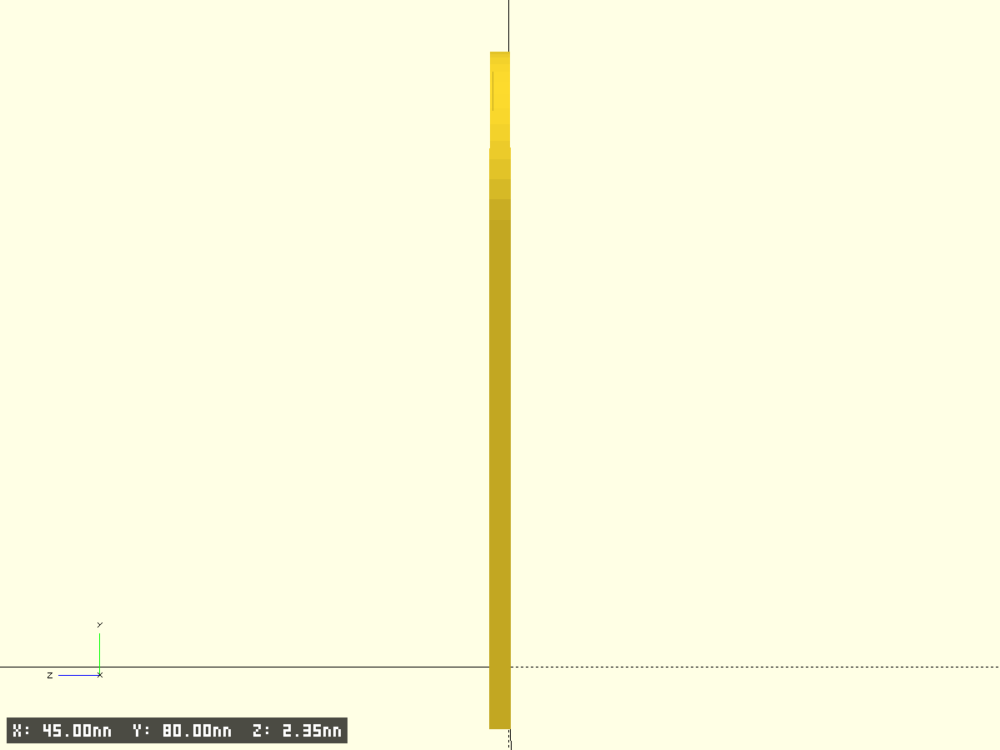

# Погон майора (съёмный, 80×45 мм)

Съёмный погон майора для рубашки/куртки: тёмно-синее поле, красная окантовка и два продольных просвета, одна золотая звезда и пуговица с гербом РФ.

- Файл модели: `pogon-major.scad`
- Версия: 1.0

## Назначение

Декоративная параметрическая модель погона для 3D-печати (одним цветом или многоцветная с паузами по Z). Геометрия ориентирована на типовой съёмный погон: прямоугольник 80×45 мм с заострённым верхом.

## Фрагменты модели

- `base_pad` — основное синее поле погона (пятиугольный контур)
- `red_border` — красная окантовка по периметру
- `red_stripe_left`, `red_stripe_right` — два продольных красных просвета
- `rank_star` — пятиконечная звезда майора
- `coat_button` — пуговица Ø14 мм с упрощённым рельефом герба РФ

## Ключевые размеры

| Параметр | Значение |
|----------|----------|
| Длина погона | 80 мм |
| Ширина погона | 45 мм |
| Звезда (описанная окружность) | 20 мм |
| Центр звезды от нижнего края | 45 мм (на оси погона) |
| Пуговица | 14 мм |
| Толщина основания | 2.0 мм |

## Печать

- Плоская укладка: модель лежит на нижнем крае (Z = 0)
- Рекомендуемая высота слоя 0.2 мм; для рельефа звезды и пуговицы — 0.1 мм на верхних слоях
- Многоцвет: `color_parts = true` — разные цвета для синего поля, красного и золотого (для превью; STL — один меш)

## Тест-фрагменты

`test_fragment = true` — печать углового фрагмента 20×20 мм (удобно проверить окантовку и просвет у нижнего края).

## Превью

