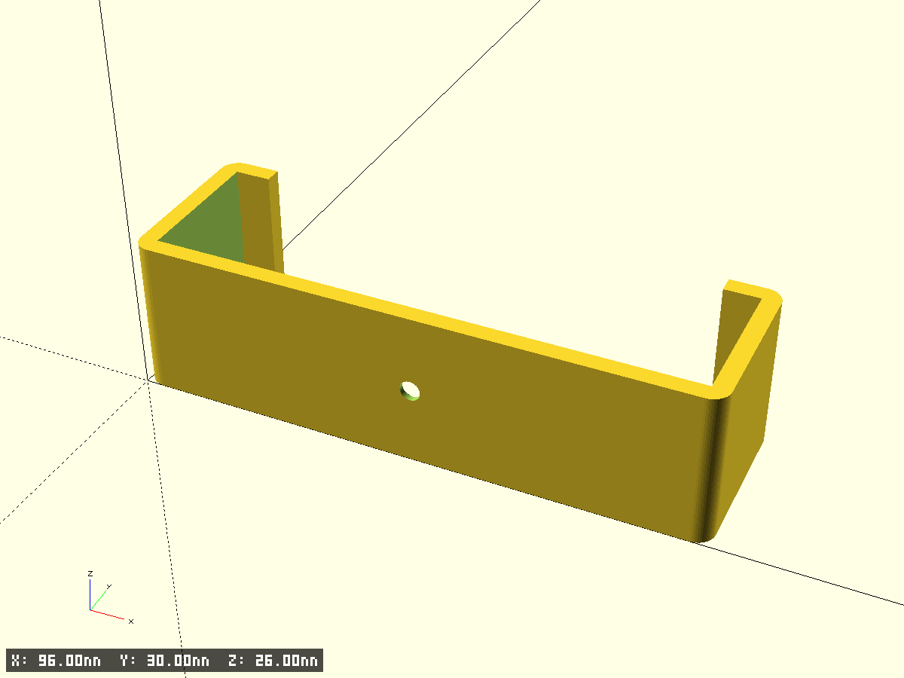
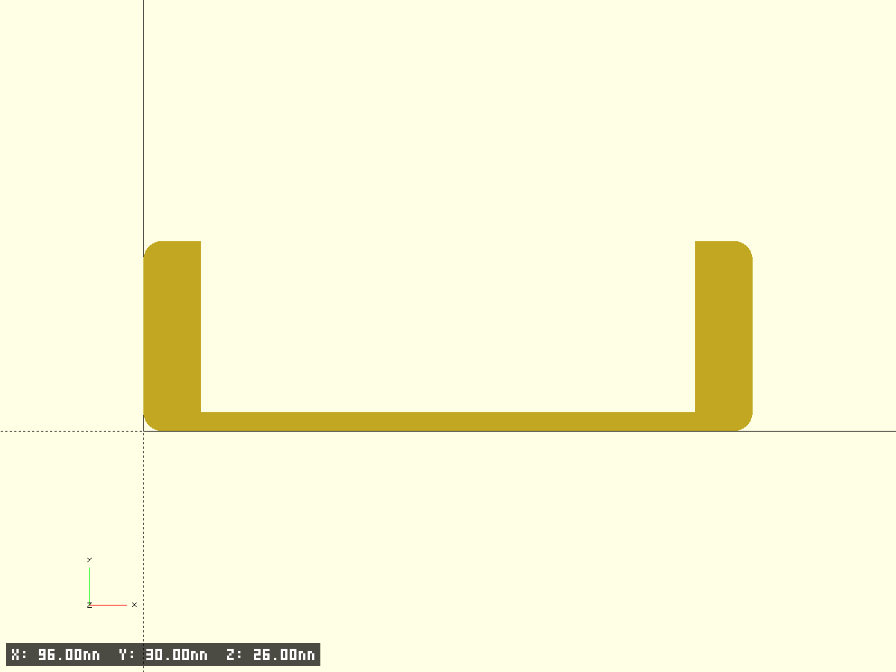
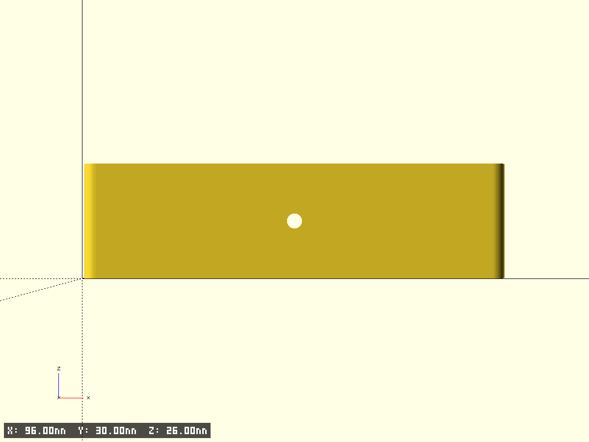
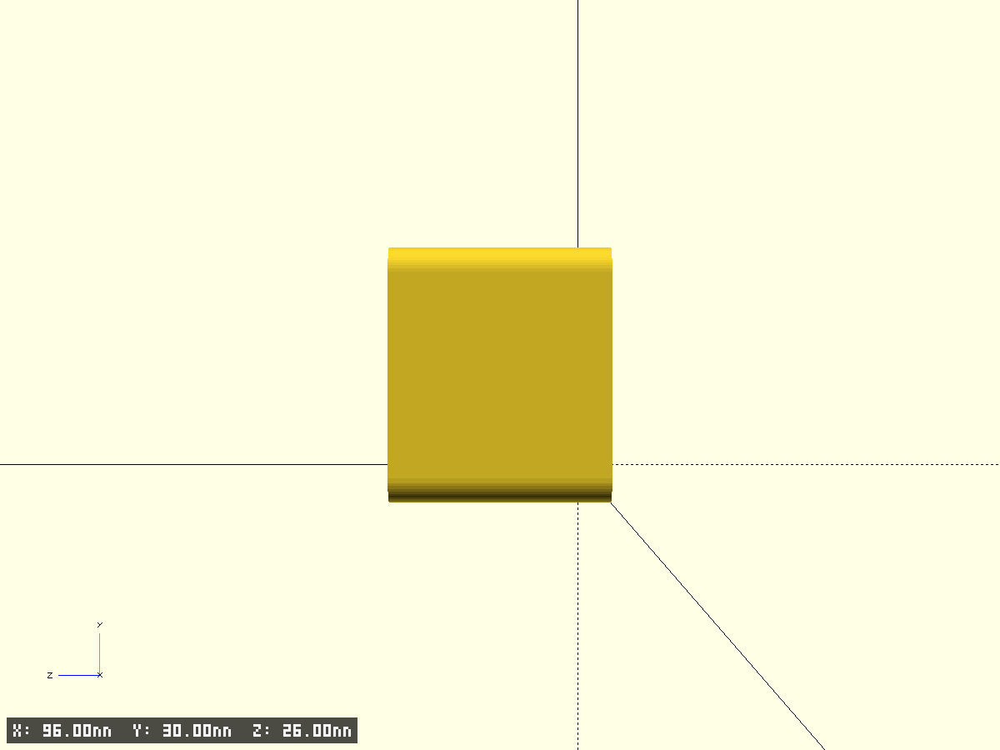

# lan switch holder

- Файл модели: `lan-switch-holder.scad`
- Версия: 1.0
- Назначение: настенный держатель LAN‑коммутатора. Коммутатор вкладывается сверху внутрь
  и обхватывается передними лапками; крепится к стене одним винтом через дно.

## Целевое устройство

[D-Link DGS-1005A](https://www.dlink.com/en/products/dgs-1005a-5-port-gigabit-unmanaged-desktop-switch) — 5‑port Gigabit Unmanaged Desktop Switch.

- Габариты корпуса (datasheet): `94 × 75 × 22.45 мм`
- Посадка в карман (`inner_w × depth_y × inner_h = 90 × 30 × 23 мм`) проверена натурно — подходит.

## Геометрия

- **Дно** — пластина с центральным отверстием под винт (плоскость XZ при `Y=0`), прилегает к стене.
- **Передние лапки** — в плоскости, параллельной дну (`Y=depth`), выступают внутрь по краям
  и обхватывают коммутатор спереди, не давая ему выпасть.
- **Нижние рельсы** (вторые лапки) — на них ложится коммутатор; сплошного дна снизу нет.
- Коммутатор опускается в карман сверху, упирается в дно и держится передними лапками.

## Фрагменты модели

- `bottom_plate` — дно с отверстием (плоско прилегает к стене)
- `left_wall` / `right_wall` — боковые стенки на всю глубину
- `left_lapka` / `right_lapka` — передние (верхние) обхватывающие лапки (плоскость параллельна дну), на всю высоту базы
- `left_rail` / `right_rail` — боковые (нижние) опорные лапки‑рельсы на всю глубину базы, коммутатор лежит на них
- у передних и боковых лапок одинаковый выступ внутрь `lapka_out`
- `mount_hole` — сквозное отверстие Ø3 мм с конической зенковкой под головку Ø7×2 мм
- `holder` — полная сборка (объединение деталей минус отверстие)

Внешние вертикальные рёбра скруглены (`corner_r`).

## Ключевые параметры

```scad
inner_w = 90;          // внутренняя ширина по X, мм
inner_h = 23;          // внутренняя высота кармана по Z, мм
depth_y = 30;          // глубина по Y, мм (передние лапки занимают передние wall_th)
wall_th = 3;           // толщина дна, стенок, лапок и рельсов, мм
lapka_out = 6;         // выступ лапок внутрь по X — одинаковый у передних и боковых, мм
screw_d = 3;           // отверстие под винт, мм
screw_head_d = 7;      // диаметр зенковки под головку, мм
screw_head_depth = 2;  // глубина зенковки (плавное сужение), мм
corner_r = 3;          // скругление внешних вертикальных рёбер, мм
```

Производные габариты: `outer_x = inner_w + 2·wall_th = 96`, `outer_z = inner_h + wall_th = 26`.
Глубина под коммутатор за лапками: `depth_y − wall_th = 27`; ширина переднего проёма: `inner_w − 2·lapka_out = 78`.

## Печать и монтаж

- Ориентация печати: как в модели, `Z=0` на стол (на нижних рельсах) — дно стоит вертикально, открытый верх кармана направлен вверх, без поддержек.
- Коммутатор опускается в карман сверху, ложится на нижние рельсы и удерживается передними лапками.
- Винт со стороны кармана: головка садится в коническую зенковку (Ø7→Ø3, глубина 2 мм), плоская грань дна прилегает к стене.
- Зазор отверстия `screw_clearance` подобран под винт Ø3; при тугой посадке увеличить.
- Для проверки посадки можно включить `test_fragment = true`.

## Превью








