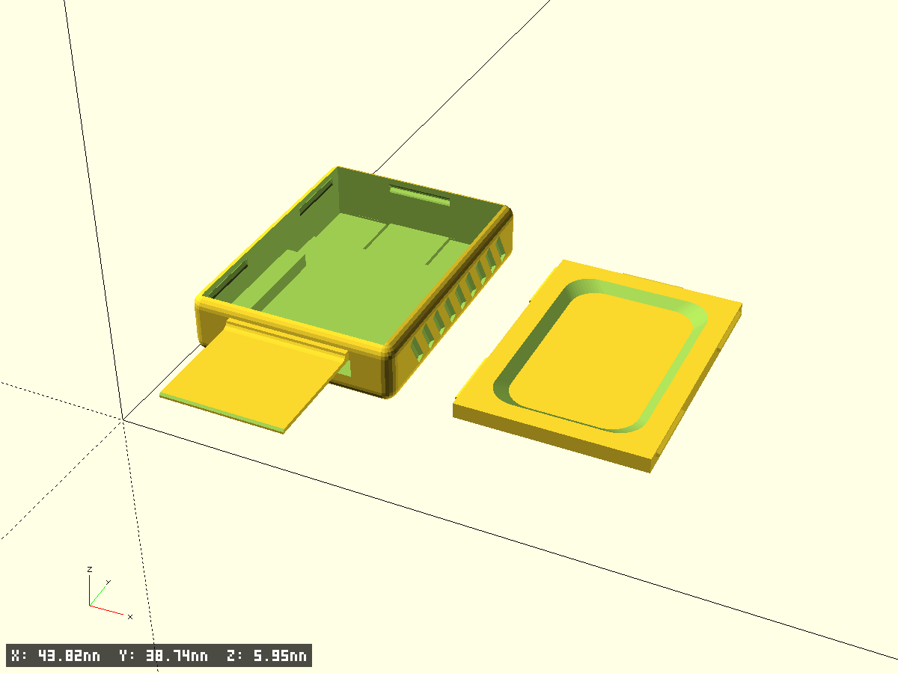
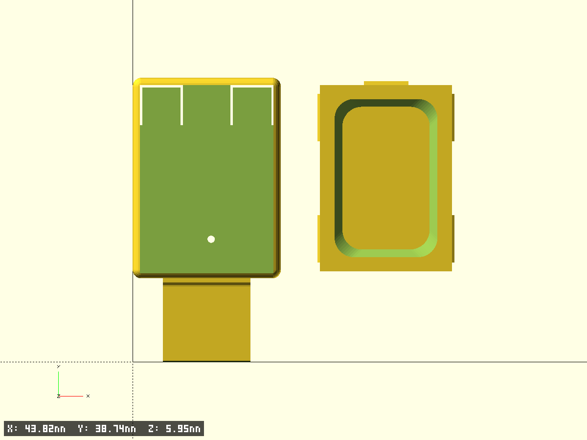
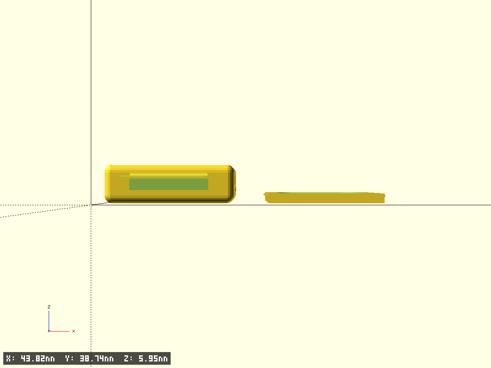
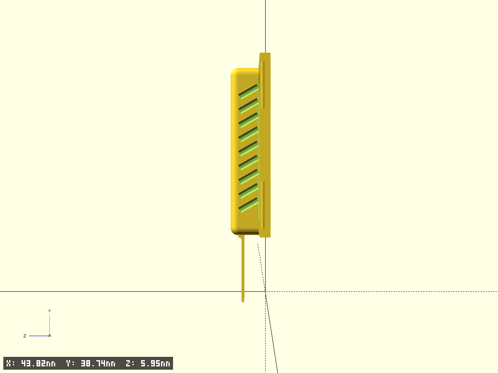

# RP2350 key case USB-A

Вариант корпуса RP2350 с рамкой USB-A на язычке платы.

Плата 1.6 мм, вставленная в порт напрямую, болтается и дребезжит: кромочный
разъём USB-A рассчитан на штекер **12.0 × 2.0 мм** при глубине вставки 12 мм,
а 1.6 мм оставляют 0.4 мм люфта по высоте. Рамка — накладка 0.4 мм поверх
выступающего язычка: вместе с платой даёт ровно 2.0 мм. Контакты платы снизу
и остаются открытыми.

- Файл модели: `rp2350-key-case-usba.scad`
- Версия: 1.0
- База: `../2026-07-25-rp2350-key-case/` — копия с добавленной рамкой
- Назначение: закрытый корпус платы RP2350 с выводом USB-C, двумя пружинящими
  кнопками в дне (BOOTSEL / RESET) и защёлкивающейся крышкой

## Происхождение модели

Модель восстановлена по двум сеткам, параметрического дерева в них нет:

- `RP2350-Case.3mf` — корпус (экспорт FreeCAD, 2037 вершин)
- `rp2350-lid.3mf` — крышка (Bambu Studio, 148 вершин)

Размеры сняты обмером сеток: лучевое зондирование (Möller–Trumbore) по трём осям
плюс горизонтальные и вертикальные срезы. Воспроизводится форма и размеры,
но не исходная триангуляция. Результат сверен с оригиналом по тем же зондам:
полость, полка, ниша, прорези кнопок, шарнирные карманы, насечки и вырез USB
совпали точно, крышка — в пределах 0.07 мм. Часть этих элементов затем
намеренно изменена под доработанную плату (см. «Отличия от оригинала»).

## Рамка USB-A

| Размер | Значение | Откуда |
|---|---|---|
| Ширина штекера USB-A | 12.0 мм | спецификация USB |
| Высота штекера | 4.5 мм (полость порта) | спецификация USB |
| Глубина вставки | 12.0 мм | спецификация USB |
| Вылет накладки `usba_len` | **11.4 мм** | по заданию, на 0.6 короче полной глубины |
| Толщина платы-штекера | **2.0 мм** | требование кромочного разъёма; 1.6 мм болтается |
| Ширина язычка платы | 11.9 мм | измерено на плате |
| Толщина накладки | **0.4 мм** = 2.0 − 1.6 | вычисляется как `usba_total_h − pcb_th` |

Устройство рамки:

- паз в передней стенке повторяет сечение язычка (11.9 + 0.15 на сторону,
  высота `pcb_th` + `usb_slot_dh` = 1.75 мм), над ним стенка сплошная — она
  служит корнем накладки. Добавка по высоте идёт вниз: сверху паз упирается
  в корень накладки, а снизу под ним ниша, а не полка
- накладка выходит вперёд на 11.4 мм, лежит на плате, спереди фаска 0.2 мм
- корень накладки утолщён до `usba_root_th = 1.0` мм на первых 0.5 мм (см. ниже)
- боковых рёбер нет: язычок 11.9 мм при порте 12.0 оставляет по 0.05 мм —
  печатать нечего. Если измерить язычок точнее и он окажется уже, поставьте
  `usba_w` меньше — рёбра появятся сами (рамка строится от ширины порта)

### Усиление корня накладки

Накладка — консоль 0.4 мм вылетом 11.4 мм: весь изгибающий момент садится на
заделку в переднюю стенку, а прямой внутренний угол там работает концентратором
напряжений (при печати это ещё и граница слоёв — самое слабое направление).
На печати 0.4 мм оказалось мало: язычок болтался.

Поэтому у корня стоит не галтель, а утолщение: брусок полной толщины
`usba_root_th` на первых `usba_root_len` мм от стенки, дальше вогнутый переход
радиусом `usba_root_r = usba_root_th − shim_th` к номинальной толщине.
Переход касательный с обеих сторон — уступа и концентратора в стыке нет.

| y от передней стенки | толщина накладки |
|---|---|
| 0 … −0.5 | **1.0 мм** (полное сечение) |
| −0.6 | 0.69 мм |
| −0.8 | 0.49 мм |
| −1.1 и дальше | 0.4 мм (номинал) |

Момент сопротивления сечения ∝ t², так что корень держит примерно в 6 раз
больший момент, чем голая накладка.

Усиление заходит внутрь корпуса на `usba_root_dy = 0.2` мм. Без этого захода
его верх вылезал бы перед скруглённым передним ребром (r=1.2, выше
z = case_z − edge_r передней плоскости уже нет) и вырождался в тонкое
непечатаемое лезвие.

**Плата за усиление — глубина посадки.** Утолщение выступает над плоскостью
2.0 мм, то есть в порт не заходит: штекер сядет на 1.1 мм мельче накладки —
**10.3 мм** при `usba_len = 11.4`. Контакты разъёма расположены глубже, на
соединение это не влияет, тем более что язычок самого разъёма отставлен от
входного отверстия на 1–2 мм и часть утолщения попадает в этот просвет.
Если посадка окажется тугой — уменьшайте `usba_root_len`, а затем
`usba_root_th`; при `usba_root_th = shim_th` усиление исчезает совсем.

## Высота корпуса и посадка крышки

Крышка целиком тонет в полости и ни на что не опирается — её положение по Z
задают только защёлки в пазах. Поэтому высота корпуса не задаётся вручную,
а выводится из стопки снизу вверх:

```
shelf_z    = floor_th + niche_h        = 0.8 + 1.4       = 2.2   верх полки
pcb_top    = shelf_z + pcb_th          = 2.2 + 1.6       = 3.8   верх платы
lid_bottom = pcb_top + pcb_top_gap     = 3.8 + 0.675     = 4.475 низ крышки
case_h     = lid_bottom + lid_h        = 4.475 + 1.5     = 5.975 верх корпуса
groove_dz  = lid_h - lid_tab_c         = 1.5 - 0.4       = 1.1   верх корпуса -> центр паза
```

Последняя строка и есть условие «крышка вровень»: паз ставится под защёлку так,
чтобы верх крышки совпал с верхом корпуса. Проверено на собранной модели
(объединение корпуса, платы и крышки): габарит по Z ровно 5.975, то есть верх
крышки совпадает с верхом корпуса, а единственное пересечение во всей сборке —
натяг задней защёлки 0.176 мм.

Единственный свободный параметр высоты — `pcb_top_gap`. Всё остальное следует
за ним один к одному.

**Зазор 0.675, а не 0.075 — по результатам печати.** На первой напечатанной
паре крышка не садилась до конца и выступала на 0.6 мм: снизу ей упиралось
(допуски печати плюс реальная посадка платы на полке). Расчётного зазора 0.075 мм
на это не хватало. Зазор увеличен на те же 0.6 — вместе с ним на 0.6 выросла
и высота корпуса, а паз и крышка уехали вверх следом, так что стык остался вровень.

### Защёлка опущена к низу крышки

В оригинале центр боковой защёлки был на 0.975 мм от низа крышки (высота крышки
1.5) — то есть у самого её верха, а паз в корпусе приходился на 0.4 мм от верхней
кромки стенки, уже в зоне скругления верхнего ребра r=1.2. Здесь защёлка опущена
(`lid_tab_c = 0.4`, высота `lid_tab_h = 0.5`), и паз ушёл вниз вместе с ней:

| | оригинал | здесь |
|---|---|---|
| Центр защёлки от низа крышки | 0.975 | **0.400** |
| Высота защёлки | 0.65 | **0.500** |
| От верха паза до кромки корпуса | 0.40 мм | **0.65 мм** |
| Стенка в самом узком месте паза | 0.621 мм | **0.636 мм** |
| Полувысота паза `groove_hh` | 0.6 | **0.45** |

Замерено по STL при `case_h = 5.975`: паз 4.425…5.325 с центром на 4.875,
защёлка занимает 4.625…5.125 — запас 0.2 мм с каждой стороны, а полка защёлки
приходится ровно на самое глубокое место паза.

Задняя защёлка сидит на той же высоте и с такими же заходными фасками
(`lid_rear_tab`). Пока она была продолжением пластины, то есть у верха крышки,
после переноса пазов вниз она переставала попадать в задний паз, упиралась
в глухую стенку и не давала крышке сесть.

## Отличия от базовой модели

| Параметр | Оригинал | Здесь | Причина |
|---|---|---|---|
| Дно (панель с кнопками) | 2.0 мм | **0.8 мм** | карман под выпаянное гнездо больше не нужен, а дно 2.0 было толстым именно ради него (карман 1.2 + остаток 0.8) |
| Высота корпуса | 8.0 мм | **5.975 мм** | не задаётся вручную: выводится из стопки дно → ниша → плата → зазор → крышка |
| Карман под гнездо | мембрана 0.8 сзади по центру | **убран** | гнездо выпаяно |
| Шарнирные карманы язычков | утончение до 1.0 | **убраны** | дно 0.8 гнётся и без них |
| Отверстие в дне | глухой карман ⌀3.0, глубина 1.2 | **сквозное ⌀1.0** | при дне 0.8 карман глубиной 1.2 не помещается; диаметр уменьшен по заданию |
| Смещение отверстия от оси | 2.1 мм | **0.6 мм** | сдвинуто на 1.5 мм к центру по заданию (`hole_cx`) |
| Ниша под платой | 1.8 мм | **1.4 мм** | по заданию |
| Буквы B/R на кнопках | есть | **отключены** | `labels_on = false`; вернуть — поставить `true` |
| Защёлка крышки / паз | центр 0.975 от низа крышки | **0.400** | паз ушёл от верхней кромки: 0.65 мм вместо 0.4 |
| Крышка относительно верха корпуса | утоплена на 0.475 | **вровень** | высота корпуса выводится из стопки, паз — из положения защёлки |
| Задняя защёлка крышки | продолжение пластины, у верха | **отдельный язычок на `lid_tab_c`** | иначе не попадала в задний паз и не давала крышке сесть |
| Прорези кнопок | полукруглая арка, язычок 10.333 мм | **прямоугольные, язычок 5.17 мм** | по заданию; свободный конец остался на месте, заделка подтянулась к нему |
| Вылет накладки USB-A | — | **11.4 мм** | по заданию, на 0.6 короче полной глубины вставки |
| Стенки боковые и задняя | 1.5 мм | **1.0 мм** | по заданию; полость под плату не изменилась, корпус ужался снаружи |
| Наружные габариты | 21.2 × 27.85 × 8.0 | **20.2 × 27.35 × 5.975** | следствие уменьшения стенок и дна |
| Глубина паза под защёлку | 0.7 мм | **0.35 мм** | при стенке 1.0 мм паз 0.7 оставил бы 0.19 мм стенки у верхней кромки |
| Выступ защёлки крышки | 0.487 мм | **0.33 мм** | согласовано с глубиной паза |
| Ориентация букв B/R | — | **развёрнуты на 180°** | взгляд на девайс с противоположной стороны (`label_flip`), сейчас буквы выключены |

Проверено по STL: дно ровно 0.8 мм по всей площади (включая место бывшего кармана),
минимальная толщина стенки в зоне паза — **0.636 мм**, просвет от дна ниши (z=0.8)
до низа крышки — **3.075 мм**.

## Геометрия

- Наружные габариты корпуса: 20.2 × 27.35 × 5.975 мм, все рёбра скруглены r=1.2
- С рамкой габарит по Y: 27.35 + 11.4 = 38.75 мм
- Полость под плату: 18.2 × 25.65 мм (не менялась — задаётся платой)
- Дно 0.8 мм; ниша под навесные детали платы: 14.2 мм шириной, дно на z=0.8
- Полка под плату на z=2.2, шириной 2.0 мм с каждой стороны, длиной 15.7 мм
- Паз под язычок платы: 12.2 × 1.6 мм в передней стенке 0.7 мм, от z=2.2
- Плата занимает z=2.2…3.8, накладка рамки z=3.8…4.2, крышка z=4.475…5.975
- Крышка: 17.96 × 25.41 × 1.5 мм (пластина 0.8 + бортик 0.7)

## Фрагменты модели

Корпус:

- `case_body` — наружный объём, все рёбра скруглены одним радиусом (minkowski)
- `case_cavity` — полость: широкая часть над полкой + узкая ниша под платой;
  за концом полки (Y > 15.7) полость на всю ширину до дна
- `usb_slot` — паз в передней стенке под сечение язычка платы
- `usba_frame` — накладка рамки USB-A поверх язычка
- `usba_root_boss` — утолщение корня накладки у передней стенки
- `lid_grooves` — пазы под защёлки крышки: по два в каждой боковой стенке
  и один в задней; профиль паза задан замеренным полигоном, нормированным
  по обеим осям — масштабируется вместе с `groove_d` и `groove_hh`
- `side_notches` — 9 диагональных насечек-канавок на каждой боковой стенке,
  врезаны внутрь на 0.3 мм (хват)
- `button_slots` — прямоугольные П-образные прорези 0.3 мм, образующие пружинящие
  язычки-кнопки. Задаются свободным концом `tongue_end` и длиной `tongue_len`:
  конец сидит над кнопкой платы и не двигается, длину меняем от заделки
- `floor_hole` — сквозное отверстие ⌀1.0 мм в дне под деталь платы
- `bottom_labels` — гравировка B (BOOTSEL) и R (RESET) 0.2 мм, читается снизу.
  Выключена флагом `labels_on = false`. При `true`: `label_flip` разворачивает
  буквы на 180° относительно оригинала (взгляд на девайс с противоположной
  стороны), каждая буква остаётся на своей кнопке

Крышка:

- `lid_plate` — пластина 0.8 мм с задним язычком (переднего нет: `lid_ftab_len = 0`)
- `lid_rim` — периметральный бортик 0.7 мм с заходной фаской 60°
- `lid_side_tabs` — четыре боковые защёлки в нижней части бортика
  (`lid_tab_c` от низа крышки), входящие в пазы корпуса
- `lid_rear_tab` — задняя защёлка, на той же высоте и с такими же заходными
  фасками, что у боковых

## Ключевые параметры

```scad
cav_w        = 18.2;     // ширина полости под плату, мм
cav_l        = 25.65;    // длина полости под плату, мм
wall         = 1.0;      // толщина боковых и задней стенок, мм
front_wall   = 0.7;      // толщина передней стенки (со стороны USB), мм
floor_th     = 0.8;      // толщина дна (панели с кнопками), мм
edge_r       = 1.2;      // радиус скругления всех наружных рёбер, мм

niche_h      = 1.4;      // высота ниши под платой, мм  -> shelf_z = floor_th + niche_h
shelf_in_hw  = 7.1;      // полуширина ниши под платой, мм
shelf_l      = 15.7;     // длина полки от переднего торца, мм

pcb_th       = 1.6;      // толщина платы, мм
pcb_top_gap  = 0.675;    // зазор над платой до низа крышки, мм (задаёт высоту корпуса)

usba_w       = 11.9;     // ширина язычка платы (= ширина рамки), мм
usba_total_h = 2.0;      // требуемая толщина штекера: плата + накладка, мм
usba_len     = 11.4;     // вылет накладки за передний торец, мм
usb_slot_dh  = 0.15;     // добавка к высоте паза под язычок платы (вниз), мм
usba_root_th = 1.0;      // толщина накладки у передней стенки, мм
usba_root_len = 0.5;     // длина участка полной толщины, мм
usba_root_dy = 0.2;      // заход усиления внутрь корпуса, мм

groove_d     = 0.35;     // глубина паза в стенке, мм
groove_hh    = 0.45;     // полувысота паза, мм
lid_tab_c    = 0.4;      // центр боковой защёлки от низа крышки, мм
lid_tab_h    = 0.5;      // высота боковой защёлки, мм
lid_tab_out  = 0.33;     // выступ боковой защёлки, мм

tongue_end   = 26.033;   // Y свободного конца язычка-кнопки, мм
tongue_len   = 5.17;     // длина язычка-кнопки, мм
slot_w       = 0.3;      // ширина прорези вокруг язычка, мм

hole_cx      = 0.6;      // смещение отверстия в дне от оси симметрии, мм
labels_on    = false;    // гравировка букв B/R на кнопках
lid_flip     = true;     // печатать крышку пластиной вниз (без поддержек)
lid_gap      = 0.12;     // зазор крышки в полости на сторону, мм
```

## Как менять под свою плату

- **`case_h` и `groove_dz` править не нужно и негде** — оба вычисляются.
  Высоту корпуса задают слагаемые стопки: `floor_th`, `niche_h`, `pcb_th`,
  `pcb_top_gap`, `lid_h`. Любое из них меняет высоту один к одному, а паз
  и крышка едут следом, сохраняя стык вровень.
- **Другая толщина платы** — правьте `pcb_th`; за ним подстроятся паз в передней
  стенке, толщина накладки (`usba_total_h − pcb_th`) и высота корпуса.
- **Детали на верхней стороне платы** — увеличьте `pcb_top_gap` на их высоту.
- **Детали на нижней стороне** — увеличьте `niche_h`; корпус вырастет на столько же.
- **Другая толщина дна** — правьте `floor_th`; полка (`shelf_z = floor_th + niche_h`),
  паз под язычок и высота корпуса следуют за ним автоматически.
- **Другая толщина стенок** — правьте `wall`; полость и крышка не изменятся,
  габариты пересчитаются сами. При `wall < 1.0` уменьшайте и `groove_d`.
- **Паз слишком близко к верхней кромке** — опускайте `lid_tab_c`: защёлка
  и паз уйдут вниз вместе, а стык крышки с корпусом останется вровень.
- **Другая плата** — `cav_w` / `cav_l` задают полость, остальное следует за ними.

## Печать

- Корпус печатается дном вниз
- **Крышка печатается пластиной вниз** (`lid_flip = true`), то есть перевёрнутой
  относительно сборки. В «сборочной» позе — бортиком вниз — пластина оказывается
  мостом над проёмом бортика ~14 × 21.5 мм и требует поддержек. Перевёрнутая
  крышка лежит пластиной на столе, а проём бортика расширяется кверху, так что
  каждый слой опирается на предыдущий. `lid_flip = false` возвращает сборочную позу
- **Накладке рамки нужна поддержка**: это пластина 0.4 мм, висящая на высоте
  z=3.8 над пустотой (там, где в сборке лежит язычок платы). Площадка небольшая,
  12 × 11.9 мм, поверхность плоская — снимается легко.
  Утолщение корня печатается поверх накладки и поддержки не требует
- Сопло 0.4, слой 0.15–0.2: тонкие места (дно и язычки-кнопки 0.8,
  стенка у паза 0.636) требуют аккуратного потока
- Дно 0.8 мм — это 4–5 слоёв по 0.2; кнопки-язычки заметно мягче, чем в оригинале
- Прорези кнопок 0.3 мм — печатаются как зазор, не как контур; при слишком
  большом потоке язычки могут слипнуться со стенкой

## Тест‑фрагменты

`test_fragment = true` вырезает угловой фрагмент `frag_size`×`frag_size`
для проверки посадки крышки и толщины стенок без печати всей детали.

## Превью








