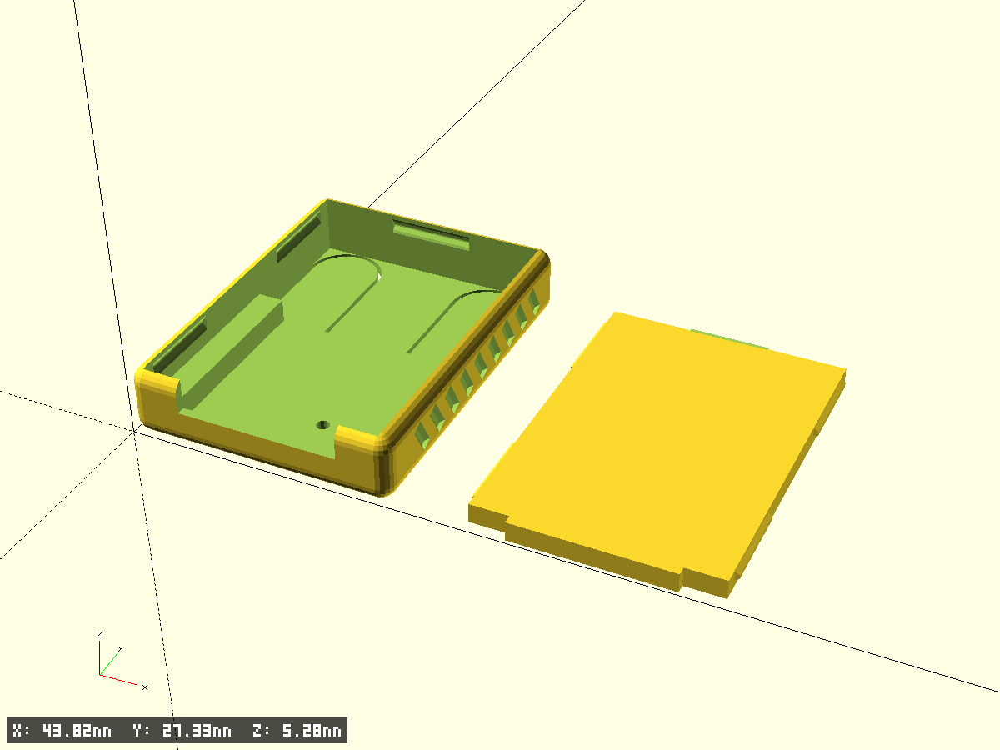
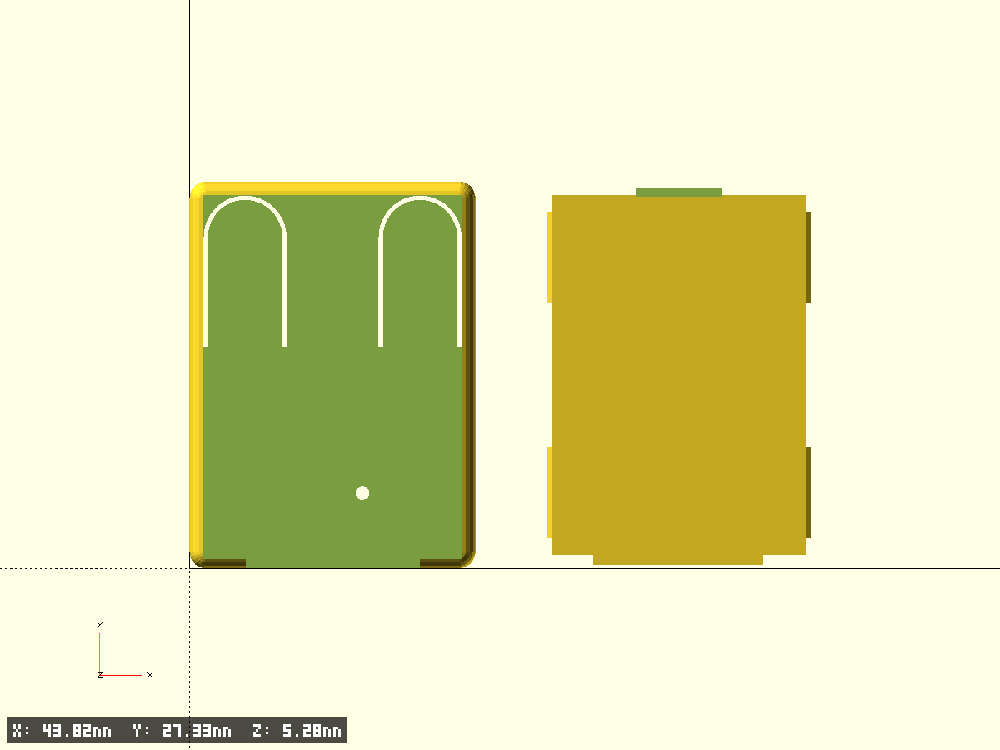
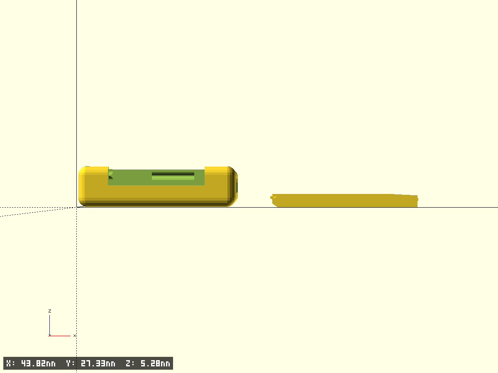
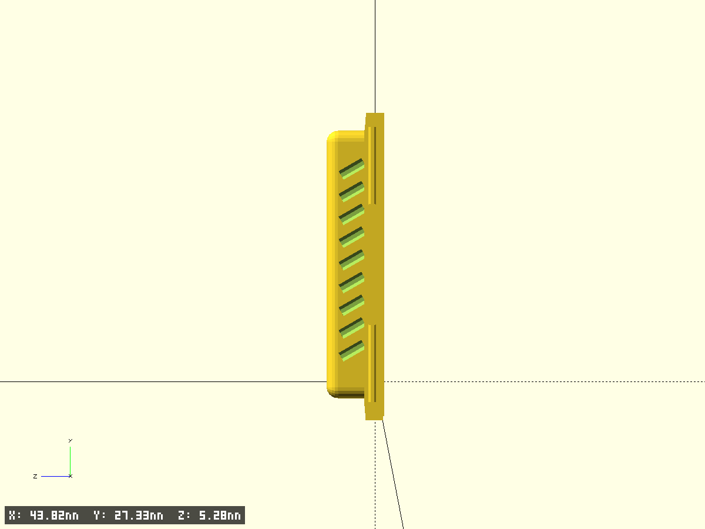

# RP2350 key case

Корпус и крышка USB-брелка на плате RP2350.

- Файл модели: `rp2350-key-case.scad`
- Версия: 1.0
- Назначение: закрытый корпус платы RP2350 с выводом USB-C, двумя пружинящими
  кнопками в дне (BOOTSEL / RESET) и защёлкивающейся крышкой

## Происхождение модели

Модель восстановлена по двум сеткам, параметрического дерева в них нет:

- `RP2350-Case.3mf` — корпус (экспорт FreeCAD, 2037 вершин)
- `rp2350-lid.3mf` — крышка (Bambu Studio, 148 вершин)

Размеры сняты обмером сеток: лучевое зондирование (Möller–Trumbore) по трём осям
плюс горизонтальные и вертикальные срезы. Воспроизводится форма и размеры,
но не исходная триангуляция. Результат сверен с оригиналом по тем же зондам:
полость, полка, ниша, прорези кнопок, шарнирные карманы, насечки и вырез USB
совпали точно, крышка — в пределах 0.07 мм. Часть этих элементов затем
намеренно изменена под доработанную плату (см. «Отличия от оригинала»).

## Отличия от оригинала

| Параметр | Оригинал | Здесь | Причина |
|---|---|---|---|
| Дно (панель с кнопками) | 2.0 мм | **0.8 мм** | карман под выпаянное гнездо больше не нужен, а дно 2.0 было толстым именно ради него (карман 1.2 + остаток 0.8) |
| Высота корпуса | 8.0 мм | **5.3 мм** | полка опустилась вместе с дном до z=2.6; просвет для платы над дном ниши сохранён 3.2 мм |
| Карман под гнездо | мембрана 0.8 сзади по центру | **убран** | гнездо выпаяно |
| Шарнирные карманы язычков | утончение до 1.0 | **убраны** | дно 0.8 гнётся и без них |
| Отверстие в дне | глухой карман ⌀3.0, глубина 1.2 | **сквозное ⌀1.0** | при дне 0.8 карман глубиной 1.2 не помещается; диаметр уменьшен по заданию |
| Стенки боковые и задняя | 1.5 мм | **1.0 мм** | по заданию; полость под плату не изменилась, корпус ужался снаружи |
| Наружные габариты | 21.2 × 27.85 × 8.0 | **20.2 × 27.35 × 5.3** | следствие уменьшения стенок и дна |
| Глубина паза под защёлку | 0.7 мм | **0.35 мм** | при стенке 1.0 мм паз 0.7 оставил бы 0.19 мм стенки у верхней кромки |
| Выступ защёлки крышки | 0.487 мм | **0.33 мм** | согласовано с глубиной паза |
| Ориентация букв B/R | — | **развёрнуты на 180°** | взгляд на девайс с противоположной стороны (`label_flip`) |

Проверено по STL: дно ровно 0.8 мм по всей площади (включая место бывшего кармана),
минимальная толщина стенки в зоне паза — **0.62 мм**, просвет от дна ниши (z=0.8)
до низа крышки — **3.195 мм**.

## Геометрия

- Наружные габариты корпуса: 20.2 × 27.35 × 5.3 мм, все рёбра скруглены r=1.2
- Полость под плату: 18.2 × 25.65 мм (не менялась — задаётся платой)
- Дно 0.8 мм; ниша под навесные детали платы: 14.2 мм шириной, дно на z=0.8
- Полка под плату на z=2.6, шириной 2.0 мм с каждой стороны, длиной 15.7 мм
- Вырез под USB-C: 12.3 мм шириной, от z=2.8 до верха, в передней стенке 0.7 мм
- Крышка: 17.96 × 25.41 × 1.5 мм (пластина 0.8 + бортик 0.7)

## Фрагменты модели

Корпус:

- `case_body` — наружный объём, все рёбра скруглены одним радиусом (minkowski)
- `case_cavity` — полость: широкая часть над полкой + узкая ниша под платой;
  за концом полки (Y > 15.7) полость на всю ширину до дна
- `usb_cutout` — вырез под USB-C в передней стенке
- `lid_grooves` — пазы под защёлки крышки: по два в каждой боковой стенке
  и один в задней; профиль паза задан замеренным полигоном
- `side_notches` — 9 диагональных насечек-канавок на каждой боковой стенке,
  врезаны внутрь на 0.3 мм (хват)
- `button_slots` — П-образные прорези 0.3 мм, образующие пружинящие язычки-кнопки
- `floor_hole` — сквозное отверстие ⌀1.0 мм в дне под деталь платы
- `bottom_labels` — гравировка B (BOOTSEL) и R (RESET) 0.2 мм, читается снизу.
  `label_flip = true` разворачивает буквы на 180° относительно оригинала —
  взгляд на девайс с противоположной стороны; каждая буква остаётся на своей кнопке

Крышка:

- `lid_plate` — пластина 0.8 мм с передним и задним язычками
- `lid_front_tab` — передний язычок на всю высоту, заходит в вырез USB
- `lid_rim` — периметральный бортик 0.7 мм с заходной фаской 60°
- `lid_side_tabs` — четыре боковые защёлки, входящие в пазы корпуса

## Ключевые параметры

```scad
cav_w        = 18.2;     // ширина полости под плату, мм
cav_l        = 25.65;    // длина полости под плату, мм
wall         = 1.0;      // толщина боковых и задней стенок, мм
front_wall   = 0.7;      // толщина передней стенки (со стороны USB), мм
floor_th     = 0.8;      // толщина дна (панели с кнопками), мм
case_h       = 5.3;      // полная высота корпуса, мм
edge_r       = 1.2;      // радиус скругления всех наружных рёбер, мм

niche_h      = 1.8;      // высота ниши под платой, мм  -> shelf_z = floor_th + niche_h
shelf_in_hw  = 7.1;      // полуширина ниши под платой, мм
shelf_l      = 15.7;     // длина полки от переднего торца, мм

usb_hw       = 6.15;     // полуширина выреза под USB-C, мм
usb_lift     = 0.2;      // от полки до низа выреза  -> usb_z = shelf_z + usb_lift

groove_d     = 0.35;     // глубина паза под защёлку, мм
lid_tab_out  = 0.33;     // выступ боковой защёлки крышки, мм
lid_gap      = 0.12;     // зазор крышки в полости на сторону, мм
```

## Как менять под свою плату

- **Высота платы изменилась** — правьте `case_h`. Просвет считается от дна ниши
  (верх дна, `floor_th`) до низа крышки: `case_h − 1.305 − floor_th`.
  Для просвета 3.2 мм при дне 0.8 нужен `case_h = 5.3`.
- **Другая толщина дна** — правьте `floor_th`; полка (`shelf_z = floor_th + niche_h`)
  и вырез USB следуют за ним автоматически, но `case_h` нужно поправить вручную
  на ту же величину, иначе изменится просвет над платой.
- **Другая толщина стенок** — правьте `wall`; полость и крышка не изменятся,
  габариты пересчитаются сами. При `wall < 1.0` уменьшайте и `groove_d`.
- **Другая плата** — `cav_w` / `cav_l` задают полость, остальное следует за ними.

## Печать

- Корпус печатается дном вниз, крышка — пластиной вниз; поддержки не нужны
- Сопло 0.4, слой 0.15–0.2: тонкие места (дно и язычки-кнопки 0.8,
  стенка у паза 0.62) требуют аккуратного потока
- Дно 0.8 мм — это 4–5 слоёв по 0.2; кнопки-язычки заметно мягче, чем в оригинале
- Прорези кнопок 0.3 мм — печатаются как зазор, не как контур; при слишком
  большом потоке язычки могут слипнуться со стенкой

## Тест‑фрагменты

`test_fragment = true` вырезает угловой фрагмент `frag_size`×`frag_size`
для проверки посадки крышки и толщины стенок без печати всей детали.

## Превью








