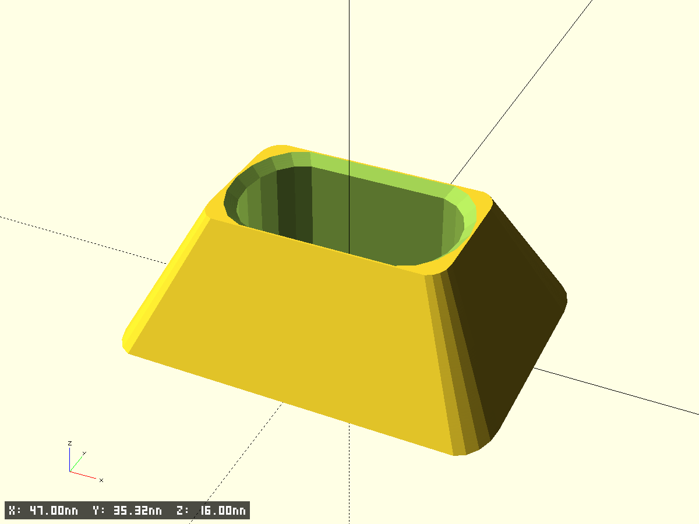
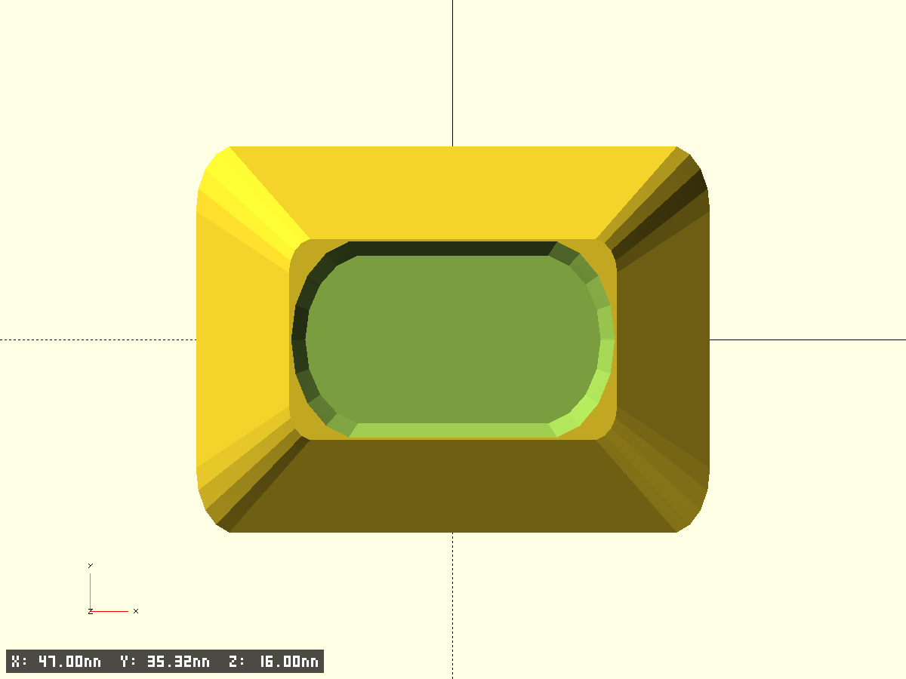
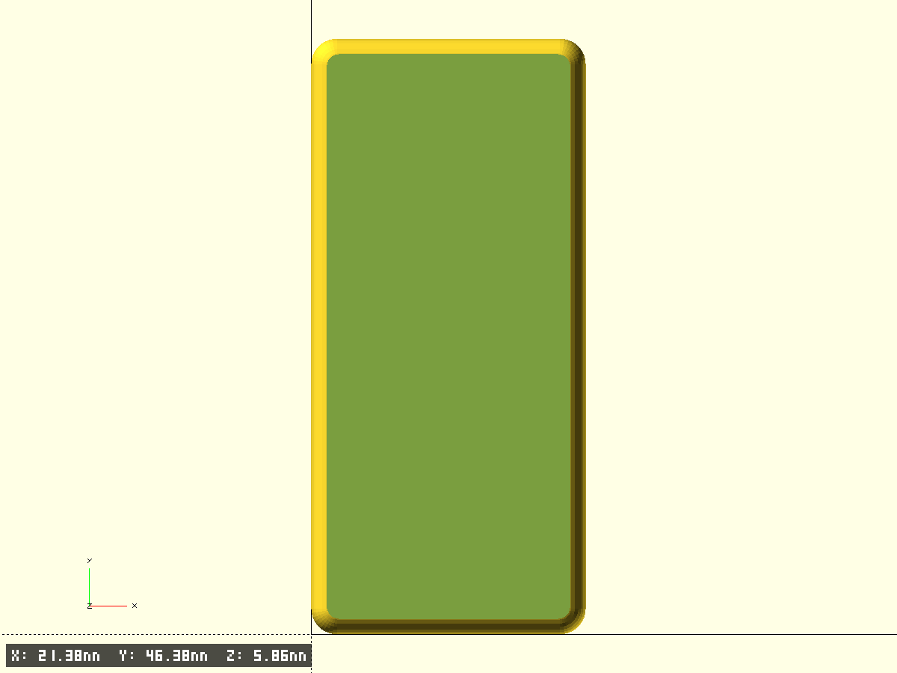
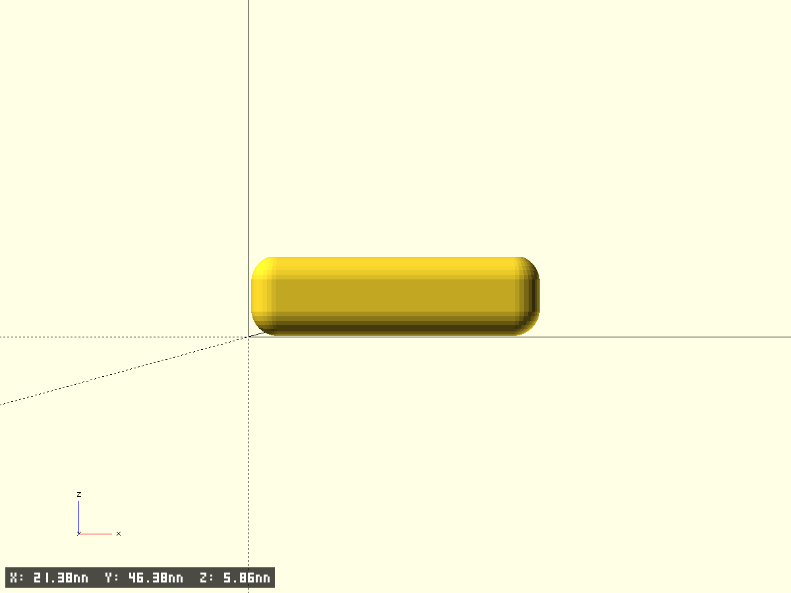
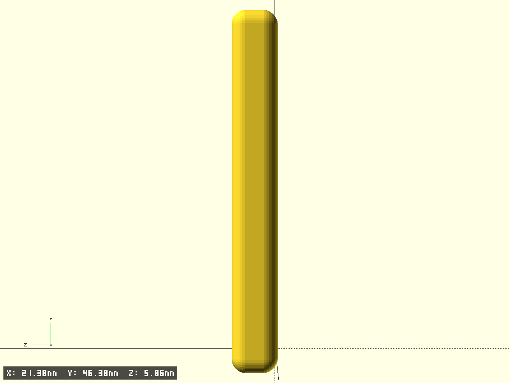
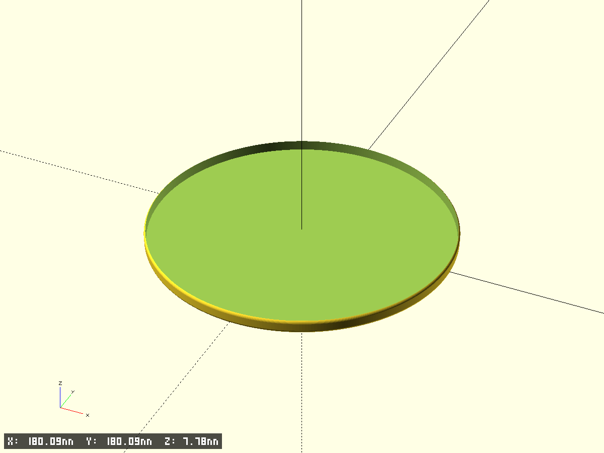
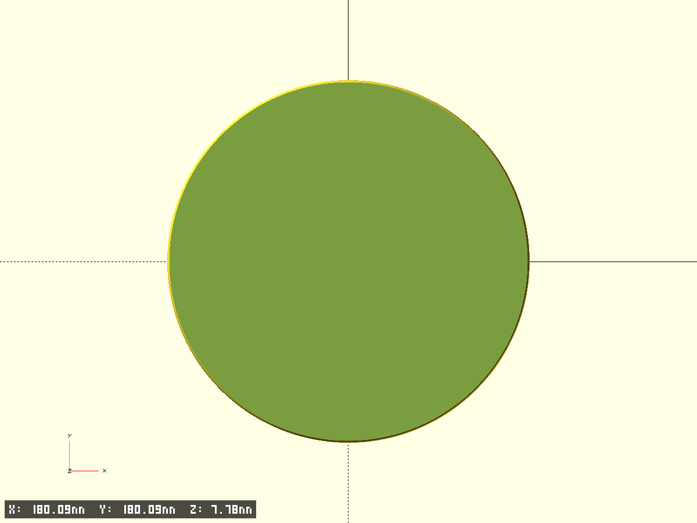

# Models

| Info | Description | Preview 1 | Preview 2 |
| ---- | ----------- | --------- | --------- |
| case-5 2025-08-24 [2025-08-24-display-case-sunton-5](2025-08-24-display-case-sunton-5/) [case-5.scad](2025-08-24-display-case-sunton-5/case-5.scad) | Две детали: основание со стойками и штырями, и рамка с окном под экран |   |   |
| ecig-platform 2025-08-24 [2025-08-24-ecig-platform](2025-08-24-ecig-platform/) [ecig-platform.scad](2025-08-24-ecig-platform/ecig-platform.scad) | ECig platform stand with oval cup |   |   |
| Horizontal Holder for 2 Bottles (75x42) 2025-08-25 [2025-08-25-bottles-holder](2025-08-25-bottles-holder/) [bottles-holder-42.scad](2025-08-25-bottles-holder/bottles-holder-42.scad) | Horizontal holder for 2 bottles, d=42, len=75 |   |   |
| Horizontal Holder for 4 Bottles (130x30) 2025-08-25 [2025-08-25-bottles-holder](2025-08-25-bottles-holder/) [bottles-holder.scad](2025-08-25-bottles-holder/bottles-holder.scad) | Horizontal Holder for 4 Bottles (130x30) |   |   |
| Circular Plate Cap Ø123.6 (shell 1 mm, height 5 mm) 2025-08-25 [2025-08-25-plate-cap-123](2025-08-25-plate-cap-123/) [plate-cap-123.scad](2025-08-25-plate-cap-123/plate-cap-123.scad) | Circular Plate Cap Ø123.6 (shell 1 mm, height 5 mm) |   |   |
| Ceiling Corner Support for Printer Frame 2025-08-25 [2025-08-25-printer-ceiling-support](2025-08-25-printer-ceiling-support/) [printer-ceiling.scad](2025-08-25-printer-ceiling-support/printer-ceiling.scad) | Ceiling Corner Support for Printer Frame |   |   |
| Audio Tools Case — base 2025-08-26 [2025-08-26-box-3-sections](2025-08-26-box-3-sections/) [audio-case.scad](2025-08-26-box-3-sections/audio-case.scad) | Audio Tools Case — base |   |   |
| Audio Tools Case — base 2025-08-26 [2025-08-26-box-ecig-cartridges](2025-08-26-box-ecig-cartridges/) [ecig-cartridges.scad](2025-08-26-box-ecig-cartridges/ecig-cartridges.scad) | Audio Tools Case — base |   |   |
| Circular Plate Cap Ø123.6 (shell 1 mm, height 5 mm) 2025-08-26 [2025-08-26-cup-cap-76](2025-08-26-cup-cap-76/) [cup-cap-76.scad](2025-08-26-cup-cap-76/cup-cap-76.scad) | Circular Plate Cap Ø76.1 (shell 1 mm, height 10 mm) |   |   |
| Mic Transceiver Box — inner 100x35x17, base + cap 2025-08-26 [2025-08-26-mic-transiever-box](2025-08-26-mic-transiever-box/) [mic-box.scad](2025-08-26-mic-transiever-box/mic-box.scad) | Mic Transceiver Box — inner 100x35x17, base + cap |   |   |
| phone iphone14 mini table holder — base 2025-08-26 [2025-08-26-phone-iphone14-mini-table-holder](2025-08-26-phone-iphone14-mini-table-holder/) [phone-holder.scad](2025-08-26-phone-iphone14-mini-table-holder/phone-holder.scad) | phone iphone14 mini table holder — base |   |   |
| Chamfered plates and extrusions  [modules.scad](modules.scad/)  | Reusable base functions and modules for OpenSCAD models | — — | — — |
| ${longName}  [templates](templates/) [default/default.scad](templates/default/default.scad) | ${shortDescription} |   |   |
