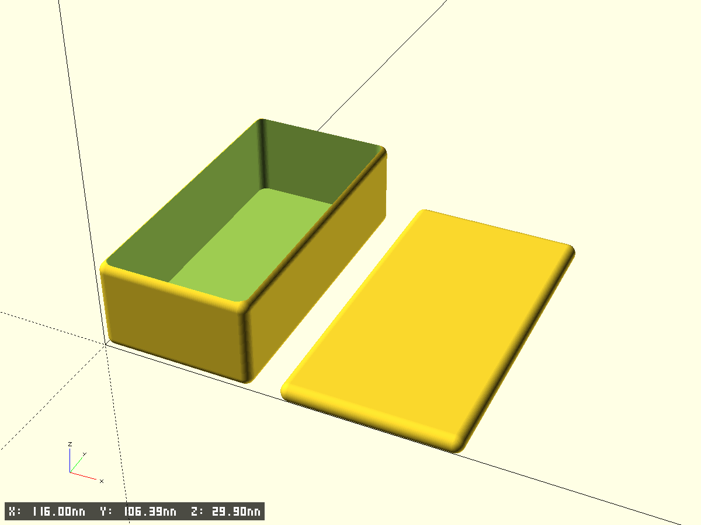
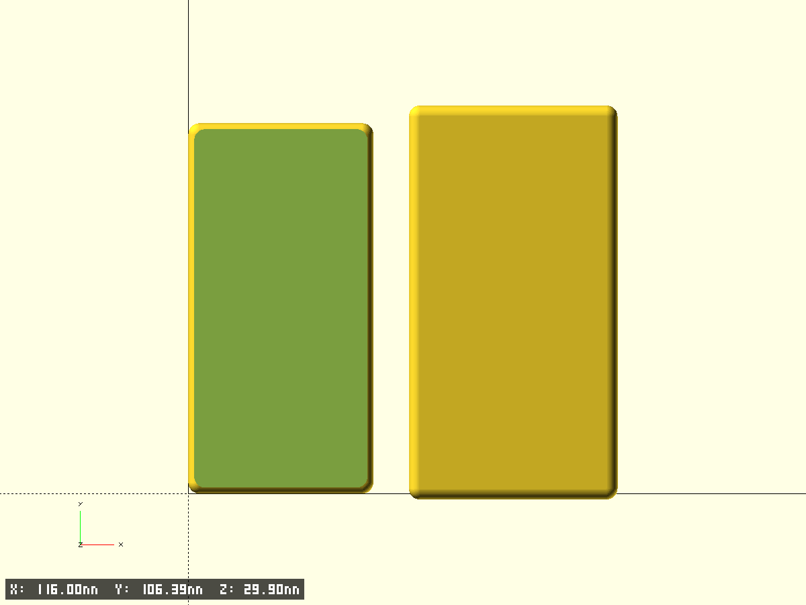
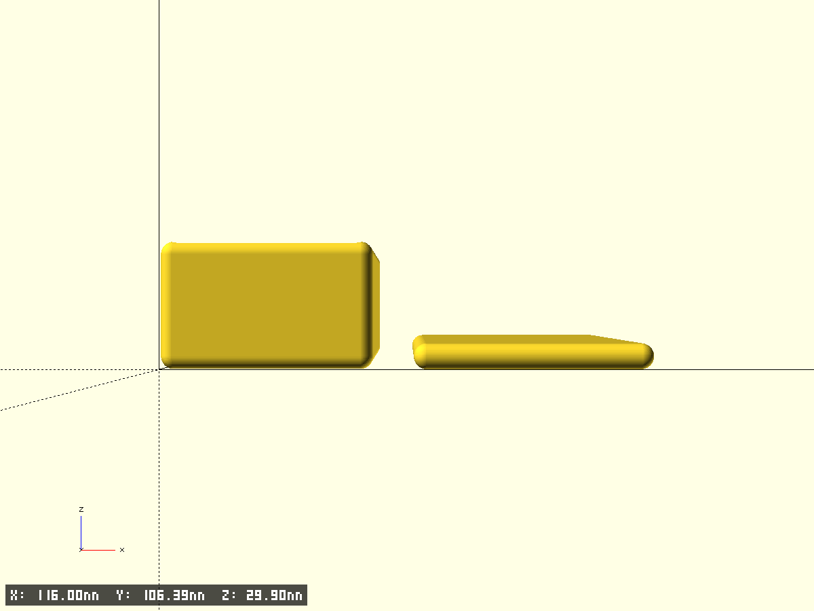
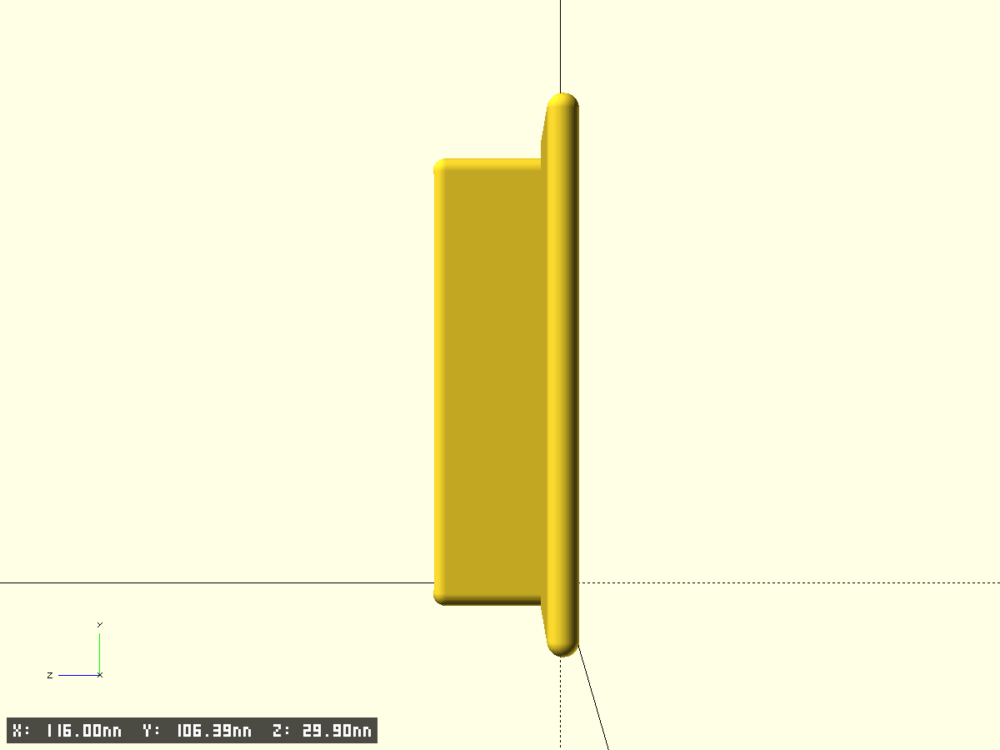

# ${longName}

- Файл модели: `${shortName}.scad`
- Версия: 1.0

## Описание

${description}

## Ключевые параметры (см. начало SCAD)

- `base_x`, `base_y`, `base_z` — габариты основания, мм
- `base_th` — толщина стенки, мм
- `radius_r` — радиус скругления углов, мм
- `mink_r` — радиус minkowski-скругления рёбер, мм
- `print_base`, `print_cap` — какие детали печатать
- `$fn`, `$fa`, `$fs`, `pin_fs` — точность окружностей
- `test_fragment`, `frag_*` — тест-фрагменты

## Превью

